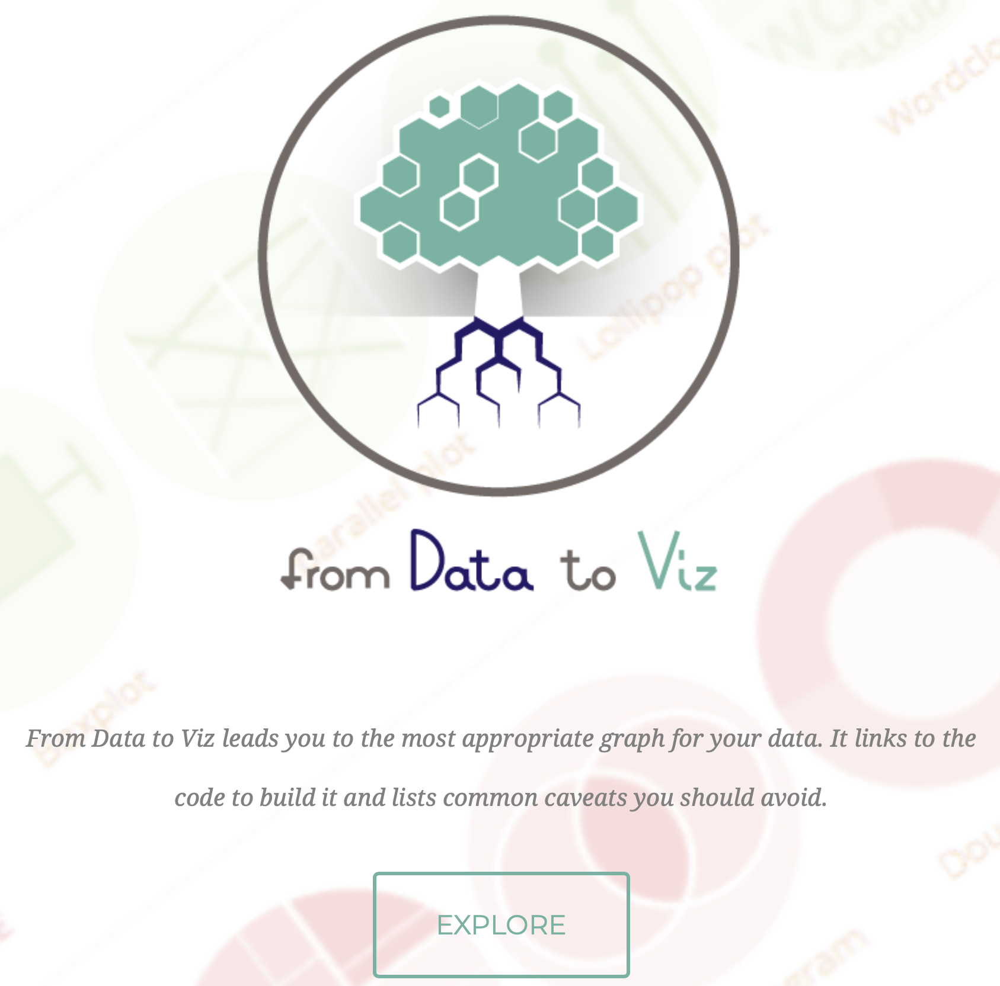
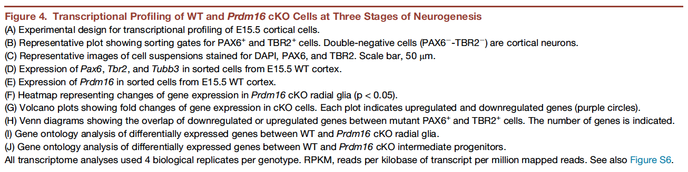
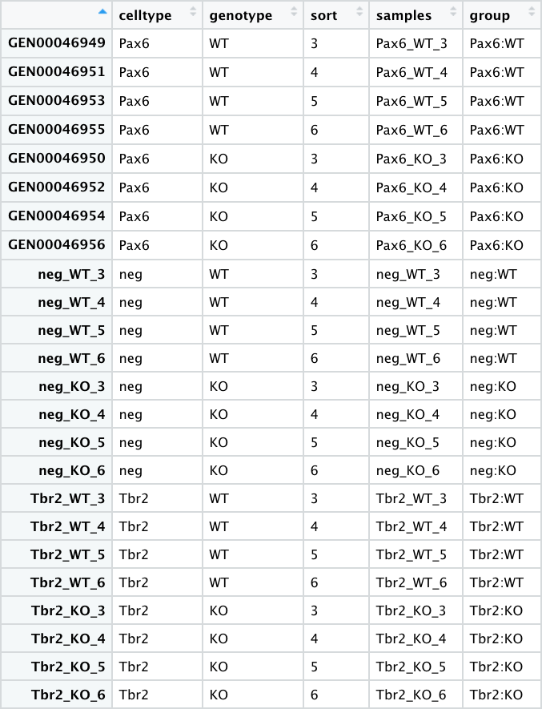
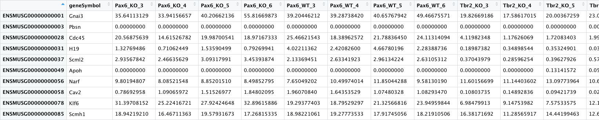
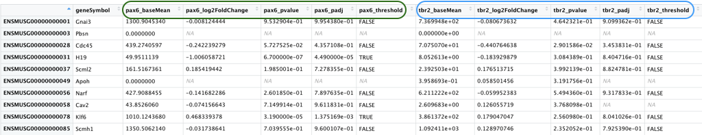

## Workshop overview

Novel and exciting discoveries in scientific research require extensive labor and dedication, but even when we have made scientific revelations, it is not meaningful unless we can communicate those breakthroughs with other members of our community. A primary means of communicating our findings is through the visualization of our results. Yet, one of the biggest challenges in disseminating research findings is **visualizing the results in a way that is meaningful, easy to interpret, aesthetically pleasing, and reproducible**. In this workshop, we will provide the tools and resources to aid in **developing visualizations most appropriate for your data and the methods to combine those visualizations into publication figures**.

## Introduction to data visualization

Visualization theory is an important for the creation of interpretable graphics; however, we ill not be exploring it in-depth. Instead, we will focus on it's application through the use of the `ggplot2` R package, which incorporates the tenets of visualization theory into practice. That being said, understanding the key elements of visualization theory can only help when creating data graphics, and there are a wealth of books and other resources available to learn more about the theory of visualization, including the fundamental book on visualization theory by Edward Tufte, [The Visual Display of Quantitative Information](https://www.edwardtufte.com/tufte/books_vdqi). In addition, a recent more-biomedical specific [paper](https://www.annualreviews.org/doi/10.1146/annurev-biodatasci-080917-013424) by O'Donoghue et al. is a good reference for do's and dont's when thinking about displaying information from various types of biomedical experiments. They highlight common practices that create misinterpretation of data, often caused by the human brain's inability to catch information and process it as we are viewing something.

In this workshop, we will focus specifically on statistical graphics using the `ggplot2` package. This package is based on the visualization theory outlined by Leland Wilkinson in the book [The Grammar of Graphics](https://www.springer.com/gp/book/9780387245447). The `ggplot2` package incorporates the visualization theory presented in the book to generate and customize quantitative graphics. This workshop will focus on the **application of the `ggplot2` package for the production of meaningful, interpretable graphics**, while extending it's functionality using additional ggplot2 extension packages and external packages.

## Types of graphics

Oftentimes, the most basic visualization question about what type of plot to create for your data is the most difficult to decide. The following questions often plague researchers looking for the perfect visualization:

1. What type of graphics are available?
2. Is my desired graphic appropriate for my data?
3. How do I create this graphic using my data?

Recently, a fabulous website was released, [from Data to Viz](https://www.data-to-viz.com), that can help address some of these fundamental questions. It provides a decision tree based on the type of data you are trying to plot. Regardless of whether your data is from genomics, chemistry, economics, business, etc., the data type generally could be grouped as:
 
 - Numeric
 - Categoric
 - Numeric and categoric
 - Maps
 - Network
 - Time series

<p align="center">

</p>

Let's navigate to the [website](https://www.data-to-viz.com) and **explore**. Let's assume we have **categoric data** with **one variable**:

1. Click on the `Categoric` button.
2. Choose the decision tree node or leaf with `One categorical variable`. Note that if you hover your cursor over this node, an example of this type of data will appear.
3. Listed beneath the node are a multitude of plots that would be appropriate for our categoric data. Let's click on the `Lollipop` graphic.
4. A brief description of the plot pops up, and if you scroll to the bottom, a link to the `Dedicated page` is available. Click on the link to the dedicated page.
5. Notice this page gives us information about when to use this plot, the variations that are available, as well as, clickable code for creating this plot in R. Let's click on the `CODE` button for the first plot (in the Definition section). 

Using this resource can help us navigate all of our basic questions, from using the decision tree to decide the type of plots available and appropriate for our data to how to create that plot using R code. However, the code may not be very interpretable to you now, since it is using the `ggplot2` package to create the plot. Throughout this workshop, we will learn how to use the `ggplot2` package, and by the end, you should understand the code used to create this figure. 

## Introduction to the dataset

Before we create any graphics, it is helpful to have a basic understanding of the data. While the `ggplot2` package and plotting methods introduced can be used for any type of data, we will be using genomics data that we have generated previously. Specifically, we will be working with RNA-seq data from a recent publication in Neuron by Baizabal et al. (2018) [[1]](https://doi.org/10.1016/j.neuron.2018.04.033). We will learn about how to use the ggplot2 package and other related packages to recreate a figure from this publication. In addition, we will also learn how to modify the figure to fit the submission criteria of a different journal. 

## The publication

The authors in this paper discover an epigenetic mechanism that controls the number and positioning of cortical neurons. They discover that the histone methyltransferase PRDM16 works with enhancer elements to either silence or activate expression of sets of genes that impact the organization of the cerebral cortex. 

<p align="center">

</p>

The authors use various techniques to identify and validate the targets and activities of PRDM16, including ChIP-seq, bulk RNA-seq, FACS, in-situ hybridization and immunofluorescent microscopy on brain samples from embryonic mice, generation of conditional knockout mice, etc. Majority of the figures in this publication are a combination of the evidence gathered from several of these techniques.

One main aspect of the paper to emphasize is the three different cell types explored are identified using marker genes:

  * **Radial Glia:** Pax6+
  * **Intermediate Progenitors:** Tbr2+
  * **Post-mitotic neurons:** Pax6- / Tbr2-

## The figure

In this workshop, we will focus on recreating [Figure 4](https://els-jbs-prod-cdn.jbs.elsevierhealth.com/cms/attachment/728f6fe8-d0ac-4893-ac8d-535469a2a1d1/gr4.jpg). This figure demonstrates how knocking out PRDM16 impacts gene expression in three different cell populations in the developing brains of mouse enbryos.

<p align="center">

</p>

<p align="center">

</p>

The different types of plots in this figure to re-create are:
* **Box plots**
* **Heatmap** 
* **Volcano plots** (essentially a scatter plot) 
* **Venn diagrams**
* **Bar plots**
 
In addition to the plots listed above, which we will create, there is (a) a very helpful **schematic of the experiment**, (b) the **FACS output** and (c) **an immunofluorescence image**, which are images that we will read in to create the final figure.

## Reading in the data

In the first half of this workshop, we will be focusing on creating those plots using the ggplot2 package. In the second half of this workshop, we will (1) explore ggplot2 extensions and external packages to complete the plots in the figure, (2) we will also add the schematics and create a figure with the same layout as in the Neuron paper, and finally, (3) we will show you how to change the layout for a different journal.

First though we need to bring the data into R!

> [Here is the link](https://www.ncbi.nlm.nih.gov/geo/query/acc.cgi?acc=GSE111660) to the GEO submission for these data.

1. We will start by downloading a basic project folder with the data by right-clicking on [this link](https://github.com/hbctraining/Training-modules/raw/master/data/publication_perfect.zip). We recommend that you place this zipped folder on your Desktop for the duration of the workshop. 
1. Unzip the folder, and navigate into the `publication_perfect` folder. Inside this folder you will find a .Rproj file. **Double-click on this to open the project in RStudio.**
1. From the menu bar select 'File' --> 'New File' --> 'Rscript'. This will open up the script editor, so you have a place to write and save your code. 
1. Copy and paste the following code into your script. Run the code in the console to read in the data and create three data frames.

```r
# Read in the metadata file
meta <- read.csv("data/pp_all_meta.csv", row.names=1)

# Read in the normalized gene expression values
normalized_counts <- read.csv("data/pp_all_normalized_counts.csv", row.names=1)

# Read in the results of the differential gene expression analysis
results <- read.csv("data/pp_all_results.csv", row.names=1)
```

### Downloaded data

The data we have downloaded and read into R above represents the following 3 files from the larger analysis described in the paper:

* **pp_all_meta.csv** - The metadata for the experiment. This experiment has **24 samples**, with each row as a sample.
  
  <details>
    <summary>More details</summary>
 
  * 4 replicates for each sample group
  * 6 sample groups (3 pairs) - `"Pax6:WT", "Pax6:KO"`, `"Tbr2:WT", "Tbr2:KO"`, `"neg:WT", "neg:KO"`
  * The *Pax6+* samples correspond to **Radial Glia**
  * The *Tbr2+* samples correspond to **Intermediate Progenitors**
  * The *neg (Pax6- Tbr2-)* samples correspond to **post-mitotic neurons**
  </details>
  
  <p align="center">
  
  </p>

* **pp_all_normalized_counts.csv** - The normalized counts for all the samples. This data frame has 25 columns - in addition to the gene name column, there is a column for each sample.

  <p align="center">
  
  </p>


* **pp_all_results.csv** - The results from DESeq2 for the comparisons between WT and PRDM16 knockout for the 3 cell types. We have combined the results from 3 separate comparisons into a single file. An excerpt is displayed below with the Pax6 results columns circled in green and the Tbr2 results columns circled in blue.

  <p align="center">
  
  </p>
  
  <details>
    <summary>More details</summary>
   
  This data frame has 16 columns - in addition to the gene name column, each of the comparisons have 5 columns of results as described below.
  
   - `_baseMean`: Mean of the normalized counts for all samples in the comparison, for a given gene
   - `_log2FoldChange`: log2 fold change between WT and PRDM16 KO
   - `_pvalue`: Wald test *P* value
   - `_padj`: Benjamini-Hochberg adjusted Wald test *P* value (P-value after multiple test correction)
   - `_threshold`: Logical vector with `TRUE` values for significantly differentially expressed (DE) genes, `FALSE` for not DE genes, `NA` for untested genes. We will be using this column in the next lecture to color the significant genes one color and the non-significant genes a different color.
  </details>


Now that we have a basic understanding of how to decide on the types of plots we would like to create and the data that we will be using, let's get started with `ggplot2`.

---
*This lesson has been developed by members of the teaching team at the [Harvard Chan Bioinformatics Core (HBC)](http://bioinformatics.sph.harvard.edu/). These are open access materials distributed under the terms of the [Creative Commons Attribution license](https://creativecommons.org/licenses/by/4.0/) (CC BY 4.0), which permits unrestricted use, distribution, and reproduction in any medium, provided the original author and source are credited.*
