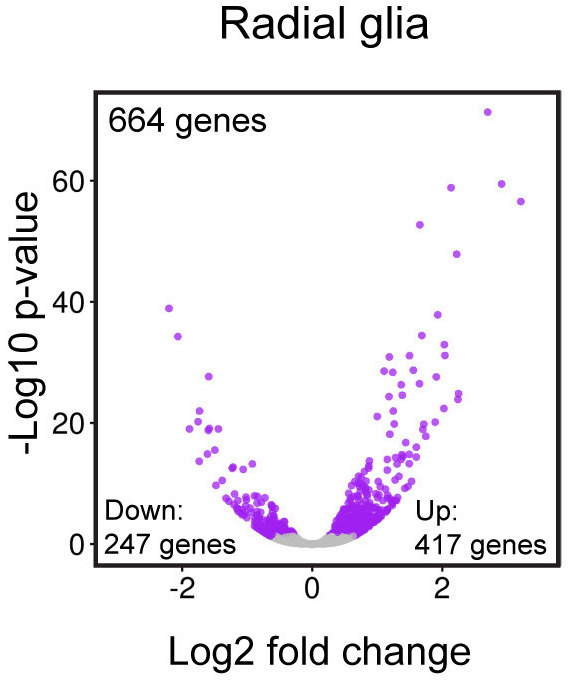
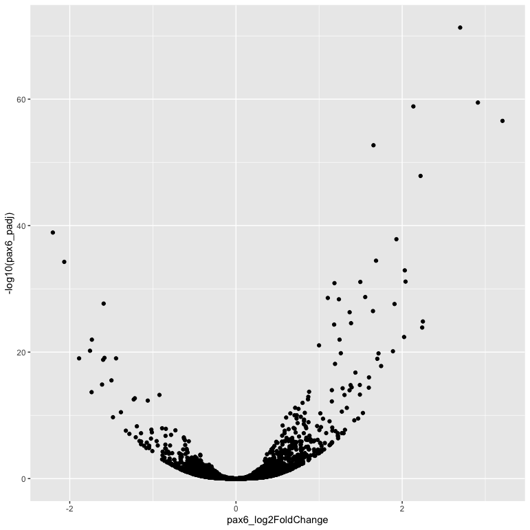
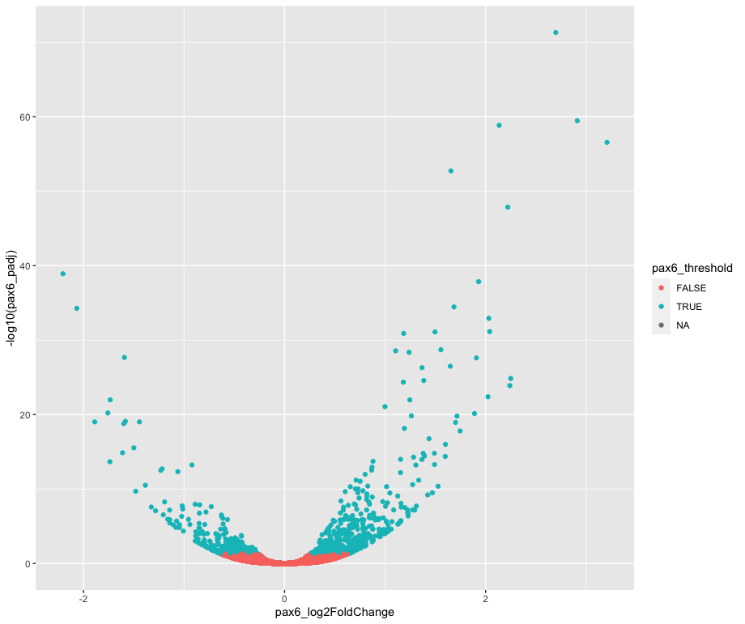
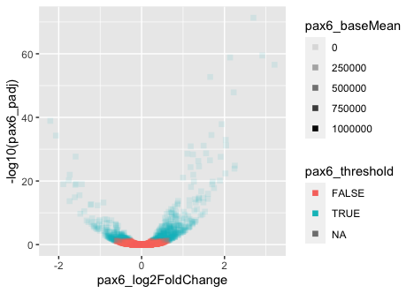
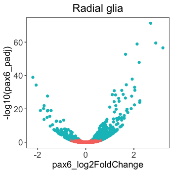
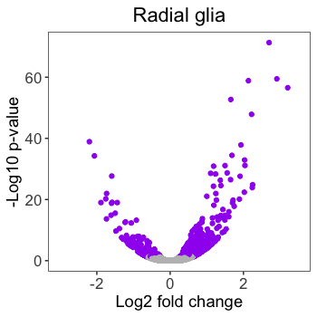

Approximate time: 60 minutes

## Learning Objectives 

* Explain the syntax to utilize the "ggplot2" package to visualize data.

# Graphical syntax of `ggplot2`

In this lesson, we will be introducing the syntax for the popular package for visualization, [`ggplot2`](https://ggplot2.tidyverse.org/). The `ggplot2` package approaches visualization using principles from the [Grammar of Graphics](https://www.springer.com/gp/book/9780387245447), a pivotal book describing quantitative graphics. The developers of `ggplot2` describe their approach to the Grammer of Graphics in a free, [online book](https://ggplot2-book.org/index.html), which can be a helpful resource for understanding the theory and organization of the `ggplot2` package. 

We will focus the majority of our this portion of the workshop on creating plots with `ggplot2` due to it's versatility and ease of customization. Once you learn the `ggplot2` syntax, you will have laid the foundation for creating a plethora of graphics.

## Set up 

Let's load the library for `tidyverse`, which is a suite of packages that includes `ggplot2` for visualization, as well as some useful packages for wrangling (`dplyr`), parsing (`stringr`) and tidying (`tidyr`) data, among others.

```r
# Load the Tidyverse suite of packages
library(tidyverse)
```

> _**NOTE:** Don't be alarmed by any conflict statements when loading this library, these statements are just informing you of packages that are currently loaded that have functions with the same name._

The `ggplot2` syntax takes some getting used to, but once you become comfortable with it, you will find it's extremely powerful and flexible. To start learning about `ggplot2` syntax we are going to re-create figure 4 from the Baizabal et al. (2018) paper. We will build the figure below using the layering approach employed by `ggplot2`. We will highlight the purpose and utility of each layer we add, while highlighting it's flexibility and customization options.

<p align="center">

</p>

Please note that `ggplot2` expects as input either a "data frame" or Tidyverse's version of a data frame called a "tibble" (you can find out more about tibbles [here](https://r4ds.had.co.nz/tibbles.html)). To create this figure we will need the data present in our `results` data frame. This plot examines the magnitude (log2 fold changes) and significance (p-adjusted values) of the differences in gene expression between the *Prdm16* KO and WT samples for every gene in radial glia cells (*Pax6*+ cells). This plot is called a "volcano plot", but it is essentially a simple X-Y scatterplot with each data point representing a gene. Let's take a look at the `results` data frame and look for the columns we are interest in.

```r
# Inspect the results data frame
View(results)
```

We see that each gene is a different row and each column corresponds to different statistics regarding the differences in gene expression between the KO and WT samples within the radial glia (`pax6_` columns), intermediate progenitors (`tbr2_` columns) and neurons (`neg_` columns). For this plot, we are interested in the radial glia, which correspond to the `pax6` columns. Specifically, we are interested in plotting the `Pax6` log2 fold changes (`pax6_log2FoldChanges`) on the x-axis and the -log10 `Pax6` p-adjusted values (`pax6_padj`) on the y-axis.

## Creating a basic plot

The `ggplot()` function is used to **initialize the basic graph structure**, then we add to it. The basic idea is that you specify different parts of the plot using additional functions one after the other and combine them into a "code chunk" using the `+` operator; the functions in the resulting code chunk are called layers.

Let's start: 

```r
# Initialize plot
ggplot(results) # what happens? 
```

You get an blank plot, because you need to **specify additional layers** using the `+` operator. The `ggplot` function does not know what type of plot you want to draw or the columns in your data frame to compare visually. At the very least, we need to provide this information.

The **geom (geometric) object** is the layer that specifies what kind of plot we want to draw. A plot **must have at least one `geom`**; there is no upper limit. Examples include:

* points (`geom_point`, `geom_jitter` for scatter plots, dot plots, etc)
* lines (`geom_line`, for time series, trend lines, etc)
* boxplot (`geom_boxplot`, for, well, boxplots!)
* [many others](https://ggplot2.tidyverse.org/reference/#section-geoms)

The [RStudio cheatsheet for ggplot2](https://github.com/rstudio/cheatsheets/blob/master/data-visualization-2.1.pdf) is a bit overwhelming at first, but it can help with choosing the best 'geom' for our data. With two continuous variables as points, we will choose to use `geom_point()`. Let's add a "geom" layer to our plot using the `+` operator.

```r
# Initializing plot
ggplot(results) +
  geom_point() # note what happens here
```

Why do we get an error? Is the error message easy to decipher?

We get an error because each type of `geom` usually has a **required set of aesthetics** to be set. "Aesthetics" are set with the `aes()` function and can be set either nested within `geom_point()` (applies only to that layer) or within `ggplot()` (applies to the whole plot).

The `aes()` function has many different arguments, and all of those arguments take columns from the original data frame as input. It can be used to specify many plot elements including the following:

* position (i.e., on the x and y axes)
* color ("outside" color)
* fill ("inside" color) 
* shape (of points)
* linetype
* size
* alpha (level of transparency)

To start, we will specify x- and y-axis since `geom_point` requires the most basic information about a scatterplot, i.e. what you want to plot on the x and y axes. All of the other plot elements mentioned above are optional.

```r
# Adding geom layer with required aesthetics mapping to columns in data frame
ggplot(results) +
  geom_point(aes(x = pax6_log2FoldChange, 
                 y = -log10(pax6_padj)))
```

<p align="center">

</p>

## Customizing the appearance of the data points on the plot

Now that we have the required aesthetics, let's add some extras like color to the plot. We can **`color` the points (representing genes)** on the plot based on the whether the genes are significant using the **`pax6_threshold` column** and specifying it within the `aes()` function. 

```r
# Adding geom layer with additional aesthetics
ggplot(results) +
  geom_point(aes(x = pax6_log2FoldChange, 
                 y = -log10(pax6_padj), 
                 color = pax6_threshold))
```

<p align="center">

</p>

You will notice that there are a default set of colors that will be used so we do not have to specify. We will explore later how to change the colors, as well as, incorporate pre-designed color palettes. Also, note that the legend has been plotted for us.

> _**NOTE:** The legend has 3 values because the `pax6_threshold` column is a logical vector with 3 values `TRUE`, `FALSE` and `NA`. The `NA` values represent those genes that were filtered out of the dataset prior to performing the statistical analysis due to low counts or severe inconsistency among replicates._

If we wanted to modify the **size of the data points** we can use the `size` argument. 

* If we add `size` inside `aes()` we could assign a numeric column to it and the size of the data points would change according to that column. 
* However, if we add `size` inside the `geom_point()` but outside `aes()` we can't assign a column to it, instead we have to give it a numeric value. This use of `size` will uniformly change the size of all the data points.

> **Note:** This is true for several arguments, including `color`, `shape`, `alpha`, etc. For example, we can change all shapes to square by adding this argument to be outside the `aes()` function; if we put the argument inside the `aes()` function we could change the shape according to a (categorical) variable in our data frame or tibble.

We have decided that we want to change the size of all the data point to a uniform size instead of mapping it to a numeric column in the input tibble. Add in the `size` argument by specifying a number for the size of the data point:

```
# Changing size to a constant (do not change with columns in data frame)
ggplot(results) +
  geom_point(aes(x = pax6_log2FoldChange, 
                 y = -log10(pax6_padj), 
                 color = pax6_threshold),
             size = 2.0)
```

> **Note:** The size of the points is personal preference, and you may need to play around with the parameter to decide which size is best. That seems a bit too big, so we can return to our default size. 

***

[**Exercise**](../answer_keys/ggplot2_syntax_Q1.md)

Let's explore how to change the aesthetics of the data points. Different shapes are available, as detailed in the [RStudio ggplot2 cheatsheet](https://github.com/rstudio/cheatsheets/blob/master/data-visualization-2.1.pdf). 

1. Change all of the points in the plot to squares.
2. Change the transparency of the points (`alpha`) to change with the base mean of `Pax6`.

***

<p align="center">

</p>

We aren't interested in keeping the points as squares or altering their transparency, but it can be helpful to change shapes, size, transparency, etc. when visualizing different groups or conditions, similar to using the `color` argument. 

## Customizing the appearance of the non-data points on the plot

Now that we know how to alter and customize the look of the data points on our plot within the `geom` layer, let's explore how to change the look of the non-data plotting elements, such as the plotting grid and labels. Many of these non-data elements can be altered within a `theme()` layer. 

The ggplot2 `theme` system handles non-data plot elements such as:

* Axis label aesthetics
* Plot background
* Facet label backround
* Legend appearance

There are built-in themes we can use (i.e. `theme_bw()`) that mostly change the background/foreground colors, by adding it as an additional layer. A nice resource for exploring pre-set themes is [available](https://ggplot2.tidyverse.org/reference/ggtheme.html) from Tidyverse. 

Let's add a layer `theme_bw()`. 

```r
# Add a pre-built theme
ggplot(results) +
  geom_point(aes(x = pax6_log2FoldChange, 
                 y = -log10(pax6_padj), 
                 color = pax6_threshold))  +
  theme_bw()
```

Let's look at the paper figure again:

<p align="center">

</p>

How are these plots different? 


We see the colors are different, but we will explore customizing those in the next lesson. All of the other changes are to the non-data elements of the plot, like legend and size of the axis titles. To explore the different non-data components customizable within the `theme()` function, let's look at the [documentation](https://ggplot2.tidyverse.org/reference/theme.html).

Notice the options for customizing the axes, titles, tick marks, and legends, among others. Everything is customizable, you just have to know what to customize. The examples given in the documentation can help determine what specifications might achieve your desired changes.

We can adjust specific elements of the current default theme by adding the `theme()` layer and passing in arguments for the things we wish to change. Since we will be adding this layer "on top", or after `theme_bw()`, any features we change will override what is set by the `theme_bw()` layer. 

Let's **increase the size of both axis titles to be 1.25 times the default size and the text labels to be 1.15 times the default.** When modifying the size of text the `rel()` function is commonly used to specify a change relative to the default.

```r
# Adjust theme elements - axis size
ggplot(results) +
  geom_point(aes(x = pax6_log2FoldChange, 
                 y = -log10(pax6_padj), 
                 color = pax6_threshold))  +
  theme_bw() +
  theme(axis.title = element_text(size = rel(1.25)),
        axis.text = element_text(size = rel(1.15)))	
```
 
<p align="center">

</p> 

> *NOTE:* You can use the `example("geom_point")` function here to explore a multitude of different aesthetics and layers that can be added to your plot. As you scroll through the different plots, take note of how the code is modified. You can use this with any of the different geometric object layers available in ggplot2 to learn how you can easily modify your plots! 

> *NOTE:* RStudio provide this very [useful cheatsheet](https://github.com/hbctraining/Intro-to-R-flipped/blob/master/cheatsheets/data-visualization-2.1.pdf) for plotting using `ggplot2`. Different example plots are provided and the associated code (i.e which `geom` or `theme` to use in the appropriate situation.) We also encourage you to persuse through this useful [online reference](https://ggplot2.tidyverse.org/reference/) for working with ggplot2.


***

[**Exercise**](../answer_keys/ggplot2_syntax_Q2.md)


1. Use the `ggtitle` layer to add the plot title. 
2. Increase the size of the plot title to be 1.5 times the default value.
3. Remove the legend by adding a `theme()` layer with the argument `legend.position`. 
4. Remove the gridlines by adding another `theme()` layer with the argument `panel.grid`.
5. Add the following new layer to the code chunk `theme(plot.title=element_text(hjust=0.5))`.
    * What does it change?
    * How many `theme()` layers can be added to a ggplot code chunk, in your estimation?

***

How does the plot compare to the published figure now? 

<p align="center">

</p>

It's quite close. Most noticably, the colors are different, the axes need proper titles, the x-axis scale is slightly different and the annotations on the plot are missing. We will finish this plot using the code below to add colors and alter the axes, but we will discuss these topics in much greater detail in future lessons.

- `scale_color_manual()`: colors the points based on groups present in `pax6_threshold` assigned to the `color` argument within the `aes()` function. 
- `scale_x_continuous()` and `scale_y_continuous()`: allows specification of the axis names and minimum and maximum axis values to be displayed on the plot.

```r
# Finished plot without annotations
ggplot(results) +
  geom_point(aes(x = pax6_log2FoldChange, 
                 y = -log10(pax6_padj), 
                 color = pax6_threshold))  +
  ggtitle("Radial glia") +
  theme_bw() +
  theme(axis.title = element_text(size = rel(1.25)),
        axis.text = element_text(size = rel(1.15))) +
  theme(plot.title = element_text(size = rel(1.5))) +
  theme(legend.position = "none") +
  theme(panel.grid = element_blank()) +
  theme(plot.title=element_text(hjust=0.5)) +
  scale_color_manual(values = c("grey", "purple")) +
  scale_x_continuous(name = "Log2 fold change", 
                     limits = c(-3, 3.5)) +
  scale_y_continuous(name = "-Log10 p-value")
```

<p align="center">

</p> 

---
*This lesson has been developed by members of the teaching team at the [Harvard Chan Bioinformatics Core (HBC)](http://bioinformatics.sph.harvard.edu/). These are open access materials distributed under the terms of the [Creative Commons Attribution license](https://creativecommons.org/licenses/by/4.0/) (CC BY 4.0), which permits unrestricted use, distribution, and reproduction in any medium, provided the original author and source are credited.*
