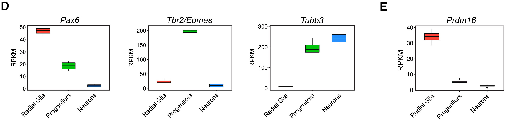
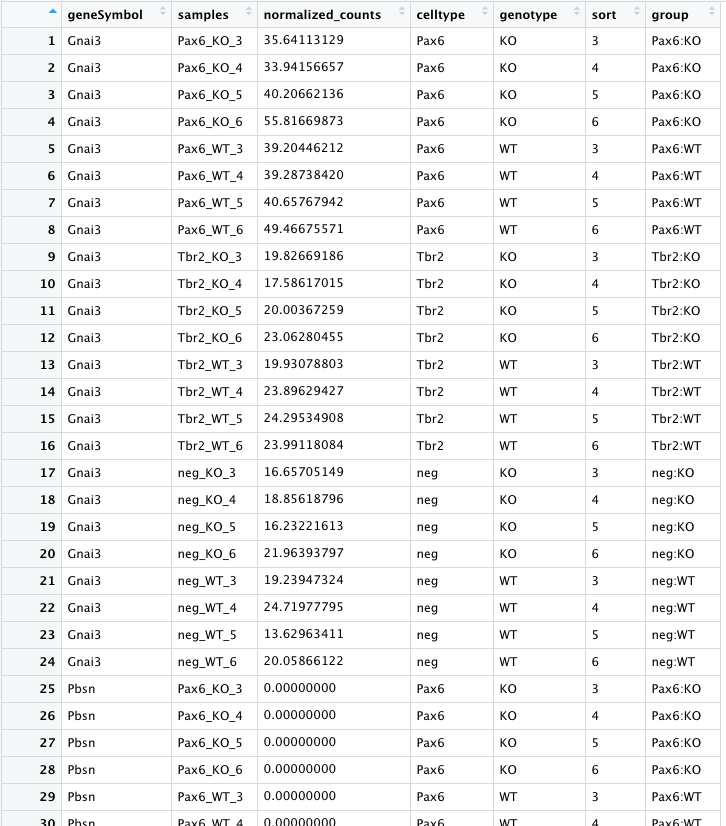
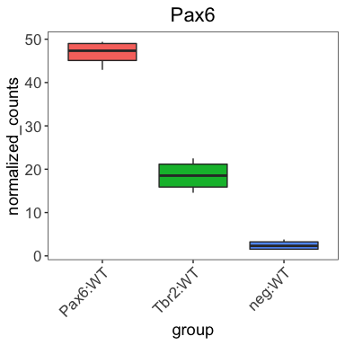

Approximate time: 60 minutes

# Application of plotting basics

We are going to use what we learned about `ggplot2` syntax and consistent themes to create the following boxplots from the paper:

<p align="center">

</p>

We want to look at the distribution in the normalized counts (y-axis) between our replicates for each cell type (radial glia (Pax6), intermediate progenitors (Tbr2/Eomes), and the cortical neurons (neg)) for **only the wild type (WT) groups**. 

A boxplot provides a graphical view of the distribution of data based on a five number summary: 
* The top and bottom of the box represent the (1) first and (2) third quartiles (25th and 75th percentiles, respectively). 
* The line inside the box represents the (3) median (50th percentile). 
* The whiskers extending above and below the box represent the (4) maximum, and (5) minimum of a data set. 
* The whiskers of the plot reach the minimum and maximum values that are not outliers. 

> In this case, **outliers** are determined using the interquartile range (IQR), which is defined as: Q3 - Q1. Any values that exceeds 1.5 x IQR below Q1 or above Q3 are considered outliers and are represented as points above or below the whiskers.

## Set up

To create this visualization, we need our `normalized_counts` data. Let's take a quick look at our `normalized_counts`.

```r
# View normalized counts table
View(normalized_counts)
```

We see that each sample is a column in the data frame and every gene is a row. We want to compare the **normalized counts between samples** using the boxplot, but it is important to note that `ggplot2` requires **data assigned to x- or y-coordinates (or any other plotting variable) is stored as a single column** in the data frame. Since the normalized counts values of each sample is stored in a different column, we need to 'gather' these columns together into a single column before we can plot them. To do this we can use a handy `tidyr` function called `pivot_longer()`.

The syntax for `pivot_longer()` is:

```r
# DO NOT RUN
# Syntax for `pivot_longer()` function
pivot_longer(input_data_frame,
             cols = columns_to_gather_together,
             names_to = "name_for_column_of_gathered_column_names",
             values_to = "name_for_column_of_gathered_values")
```

For our `normalized_counts` data frame, we want to gather all of the normalized counts into a single column (all columns except for `geneSymbol`. Therefore, our gathering of columns from a wide to long format is:

```r
# Gather values to plot into a single column
expression_plot <- pivot_longer(normalized_counts,
                                cols = 2:25,
                                names_to = "samples",
                                values_to = "normalized_counts")
```

Finally, we want to color our plot with information about the cell types/groups of our samples. Currently we have only the expression data (normalized counts). We need to merge the expression data with the metadata information for each of our samples. We can use a `_join` function from the Tidyverse.

```r
# Join metadata for visualizing groups or features
expression_plot <- left_join(x = expression_plot, 
                             y = meta, 
                             by = "samples")
			   
# Examine the contents of the expression_plot data frame
View(expression_plot)			   
```

<p align="center">

</p>

Lastly, we need to filter `expression_plot` for the genes of interest: `Pax6`, `Eomes`, `Tubb3` and `Prdm16`, to create separate plots for each gene. We will start to create the boxplot for the Pax6 gene in this lesson, then finish the Pax6 boxplot in subsequent lessons, followed with boxplots for the other genes.
	
```r
### Extract normalized counts for specific genes to plot
pax6_exp <- expression_plot %>%
filter(geneSymbol == "Pax6" &
       genotype == "WT")
       
eomes_exp <- expression_plot %>%
filter(geneSymbol == "Eomes" &
       genotype == "WT")

tubb3_exp <- expression_plot %>%
filter(geneSymbol == "Tubb3" &
       genotype == "WT")

prdm16_exp <- expression_plot %>%
filter(geneSymbol == "Prdm16" &
       genotype == "WT")       
```
	
Now we should be ready to create our `Pax6` boxplot. Let's make sure we have all information for normalized counts and sample groups (`group`) each in a single column before we proceed:

```r
View(pax6_exp)
```

Looks good! Let's make our boxplot!

## Boxplot!

**Create the Pax6 boxplot by following the instructions below:**

1. Create a boxplot using the `geom_boxplot()` layer to plot the normalized counts of the different groups (neg:WT, Pax6:WT, Tbr2:WT).
2. Use the `fill` *aesthetic* to look at differences between groups (neg:WT, Pax6:WT, Tbr2:WT).
3. Add a title matching the published figure.
4. Re-factor the x-axis variable 'group' to be in the same order as the paper using the following code:
	
	```r
	### Re-factor the x-axis variable 'group' to be in the correct order
	pax6_exp$group <- factor(pax6_exp$group, levels = c("Pax6:WT", "Tbr2:WT", "neg:WT"))
	```
	
5. Change the angle of the x-axis labels to match the figure below using the `theme()` function (this [resource](http://www.sthda.com/english/wiki/ggplot2-axis-ticks-a-guide-to-customize-tick-marks-and-labels) can be helpful): the `hjust` and `vjust` arguments can help your plot look more appealing.
6. Use your personal theme to keep your plots consistent.

**After running the above code the boxplots should look something like the plots below.**

<p align="center">

</p>

_Detailed code used to create the boxplot can be found in the [answer key](../answer_keys/boxplots_Q1.md)._

---
*This lesson has been developed by members of the teaching team at the [Harvard Chan Bioinformatics Core (HBC)](http://bioinformatics.sph.harvard.edu/). These are open access materials distributed under the terms of the [Creative Commons Attribution license](https://creativecommons.org/licenses/by/4.0/) (CC BY 4.0), which permits unrestricted use, distribution, and reproduction in any medium, provided the original author and source are credited.*


