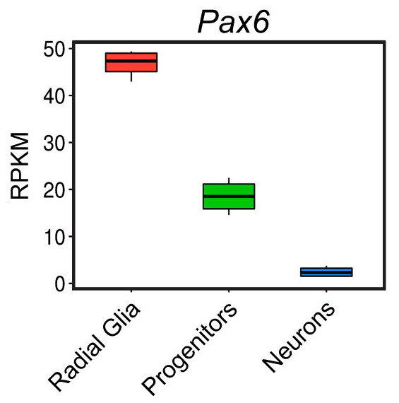
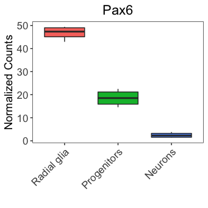
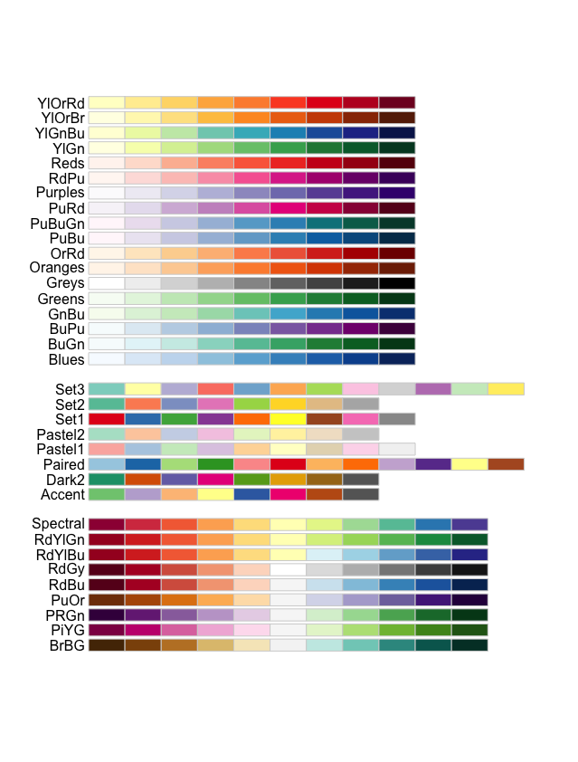
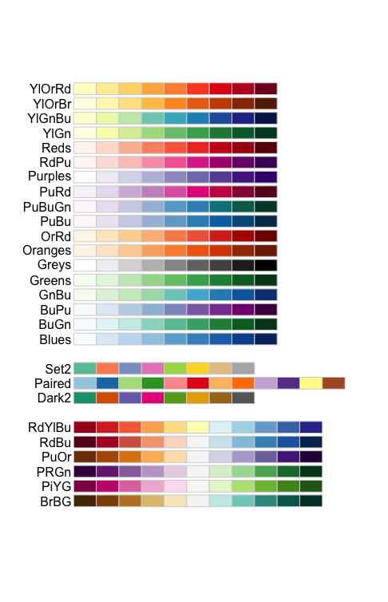
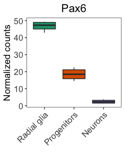

# Customizing plots using scales and colors

Thus far, when plotting with `ggplot2`, we have observed default values incorporated in the aesthetic mappings. For example, by default in our boxplot,  the column values in our data frame become the x- and y-axis labels and the colors assigned default to a standard set used by `ggplot2`. 

```r
ggplot(pax6_exp) +
  geom_boxplot(aes(x=group, 
                   y=normalized_counts, 
                   fill=group)) +
  ggtitle("Pax6") +
  personal_theme() +
  theme(axis.text.x = element_text(angle = 45, 
                                   vjust = 1, 
                                   hjust = 1))

```

While the defaults tend to look okay, we often desire to customize these values. To customize the aesthetic mappings (specifications made within the `aes()` function), we can use **scales**, which are available for every mapping and data type.

## Scales

In `ggplot2`, **scales control the content that is displayed on the plot**, including how the data points look (size, shape, transparency, color, fill, etc), as well as, the values of the axes and legends. The ggplot2 book devotes an [entire section](https://ggplot2-book.org/scales.html) to scales and understanding them will help make the ggplot2 syntax more intuitive.

## Position and axes

The first set of scales we will discuss correspond to plot position and axes. The x- and y-axis scales allow us to alter the axis titles, limits, breaks (at which values the ticks are labeled), and tick mark labels. The most common scales are for discrete and continuous data:

* `scale_x_continuous()`: for continuous x-axis values
* `scale_y_continuous()`: for continuous y-axis values
* `scale_x_discrete()`: for categorical or qualitative x-axis values
* `scale_y_discrete()`: for categorical or qualitative y-axis values

There are also scales for common transformations and modifications often used when visualizing data, including the following x-axis scales (also available for the y-axis):

* `scale_x_log10()`
* `scale_x_reverse()`
* `scale_x_sqrt()`
* `scale_x_binned()`

Using these position or axis scales, we can customize the axis titles (`name`), axis limits (`limits`), axis breaks (`breaks`), and tick labels (`labels`). Using these `scale_` functions, we can alter the **values** of the axes and ticks; however, it is worth noting that the **look and style (e.g. size, thickness, style, angle, justification, etc.)** of the axes and labels are still altered within the `theme()` function.

Let's change the names of the x-axis labels to match the figure in the paper shown below.

<p align="center">

</p>


Let's add a layer to our ggplot code to remove the title and rename the tick labels on the x-axis. What `scale_` function do you think we should use?

```r
# Check the scale_ function arguments using the ?
?scale_<tab>

# Boxplot with renamed x-axis values
ggplot(pax6_exp) +
  geom_boxplot(aes(x=group, 
                   y=normalized_counts, 
                   fill=group)) +
  ggtitle("Pax6") +
  personal_theme() +
  theme(axis.text.x = element_text(angle = 45, 
                                   vjust = 1, 
                                   hjust = 1)) +
  scale_x_discrete(name = "",
                   labels=c("Pax6:WT" = "Radial Glia",
                            "neg:WT" = "Neurons", 
                            "Tbr2:WT" = "Progenitors"))
```

When providing tick labels, we can either provide a vector of names, which are applied based on factor levels, or we can provide the names using the format above (e.g. "current label" = "new label") to ensure proper labeling.

Now let's rename the y-axis title to be "Normalized counts" as in the publication. What `scale_` function do you think we should use? Our plot should now resemble closely the published figure. The only differences are some of the text on the image that we will learn about in later lessons.

<p align="center">

</p>

***

**Exercises**

Let's explore the other graphical elements using the position scales.

1. Change the limits of the **y-axis** to range from 0 to 100 and have breaks (where the ticks are labeled) to be every 20 instead of every 10.
2. Use a log10 scale for the **y-axis** using a `scale_` function.

***


## Differential mapping scales

Aside from the axis data, the other data included in our aesthetic mappings (within the `aes()` function) correspond to variables from which we want to observe differences using visible output, such as color, fill, shape, size, line type, transparency, etc. Each of these mappings has an associated scale in which you can customize the output. 

For example, when we run the code below, additional layers are added under the hood.

```r
ggplot(pax6_exp) +
  geom_boxplot(aes(x=group, 
                   y=normalized_counts, 
                   fill=group))
```

The additional layers in the code below were automatically added to our code to create the plot:

```r
ggplot(pax6_exp) +
  geom_boxplot(aes(x = group, 
                   y = normalized_counts, 
                   fill = group)) +
  scale_x_discrete() + 
  scale_y_continuous() + 
  scale_fill_discrete()
```

All defaults for these additional layers were used, so we do not notice that they are added. However, it is important to know that for every argument in our `aes()` function, a corresponding scale is created and run along with our input code.

For example, if we wanted to alter the linetype based on group, we could add another layer using the `linetype` argument. We know that a `scale_linetype_discrete()` layer is added when we run the code below. 

```r
ggplot(pax6_exp) +
  geom_boxplot(aes(x = group, 
                   y = normalized_counts, 
                   fill = group,
		   linetype = group))
```

Since the `fill` and `linetype` arguments are mapped to the same variable, `group`, by default, the legends for these two mappings are combined into a single legend called 'group'. If we alter the name or labels of the `fill` or `linetype` scales, we will see the legend split. Let's test it out by customizing the `scale_linetype_discrete()` layer.

```r
ggplot(pax6_exp) +
  geom_boxplot(aes(x = group, 
                   y = normalized_counts, 
                   fill = group,
                   linetype = group)) +
  scale_linetype_discrete(name = "Wildtype group",
                          labels = c("Pax6 wildtype", "Intermediate wildtype", "Neurons wildtype"))
```

Using these `scale_` layers with our differential aesthetics allow us to easily change the titles, text, and display within the legends. For additional customization of the style or position of the legends, we can use the `theme()` function. In addition, `ggplot2` offers an additional quick way to alter the appearance of legends by using the helper function, `guides()`. We aren't going to go into depth into this function, but more details can be found [here](https://www.datanovia.com/en/blog/ggplot-legend-title-position-and-labels/).

> _**NOTE:** There are several 'helper' functions to make editing the axis labels and limits a bit easier, including `xlab()`, `ylab()`, `xlim()`, and `ylim()`._

## Color scales

While the default colors may be fine for many applications, they are often not sufficient to highlight the relationships of interest or are not optimal for the intended audience/publication. 

For our boxplot, the default colors look great; however, they are not optimal for color-blind viewers. Since we are preparing for publication, we would like our figures to be interpretable for all readers. To determine palatable palettes, we should consider features of the colors that affect human perception, specifically:

- **Hue:** type of color (e.g. pink, red, blue)
- **Chroma:** colorfulness ranging from gray (no color) to full color
- **Luminance:** brightness

There are cheatsheets available for specifying the base R colors by [name](https://cpb-us-e1.wpmucdn.com/sites.ucsc.edu/dist/d/276/files/2015/10/colorbynames.png) or [hexadecimal](http://www.sthda.com/english/wiki/color-chart-hexadecimal) code, and there are these websites [here](https://hclwizard.org) and [here](http://tristen.ca/hcl-picker/#/hlc/6/1.05/113840/D4E966) for picking colors or palettes of interest and returning the hexadecimal code(s). To apply any of these colors to our plot, we can individually specify the colors by providing them within a `scale_` layer.

To alter the colors in our plot that map to our data, we use the `color` or `fill` options within the `aes()` function. We used the `fill` argument to color our boxplot by `group`. To change the color of our `fill`, we can add a fill scale layer, and most often one of the following two scales will work:

- **`scale_fill_manual()`:** for categorical data or quantiles
- **`scale_fill_gradient()` family:** for continuous data. 

For our categorical `group` data, we will add the `scale_fill_manual()` layer, specifying the desired color values. Pick whichever colors you like.


```r
# Visualize the Pax6 boxplot with custom colors
ggplot(pax6_exp) +
  geom_boxplot(aes(x=group, 
                   y=normalized_counts, 
                   fill=group)) +
  ggtitle("Pax6") +
  personal_theme() +
  theme(axis.text.x = element_text(angle = 45, 
                                   vjust = 1, 
                                   hjust = 1)) +
  scale_x_discrete(name = "",
                   labels=c("Pax6:WT" = "Radial glia",
                            "neg:WT" = "Neurons", 
                            "Tbr2:WT" = "Progenitors")) +
  scale_y_continuous(name = "Normalized counts") +
  scale_fill_manual(values = c("firebrick4", "lightsteelblue", "yellow2"))
```

 
We can also use pre-created color palettes from external R packages. This [R Graph Gallery site](http://www.r-graph-gallery.com/ggplot2-color.html) has a nice interactive app for exploring how to find and incorporate desired colors into your plots.

Since the goal of this workshop is 'publication quality' plots, we should be aware of the significant portion of our population who are color-blind. To encourage the use of color-blind friendly selections, we will focus our attention on these palettes. We will identify those palettes from the packages `RColorBrewer` and `viridis`. 

### RColorBrewer palettes

We will start by exploring the `RColorBrewer` library, which contains color palettes designed specifically for the different types of data being compared, with palettes specifically highlighting sequential, qualitative, and diverging data. 

```r
# Load the RColorBrewer library
library(RColorBrewer)
```

The available palettes can be viewed using the `display.brewer.all()` function:

```r
# Check the available color palettes
display.brewer.all()
```

<p align="center">

</p>

The palettes are separated into three sections based on the type of data: 

- **Sequential palettes (top):** For sequential data, with lighter colors for low values and darker colors for high values.
- **Qualitative palettes (middle):** For categorical data, where the color does not denote differences in magnitude or value.
- **Diverging palettes (bottom):** For data with emphasis on mid-range values and extremes.

Let's explore changing the colors of our boxplot (shown below), created earlier using default colors. 

<p align="center">

</p>

The boxplot is colored by `group`, which is a categorical variable. Therefore, we will choose a **Qualitative palette** to assign contrasting colors to the groups. We can choose how many colors from the palette to include, which for our data will be three colors (one for each group). Let's choose the **Set1** palette and see how we like it. We can view the colors included in a palette by using the `display.brewer.pal()` function:

```r
# Viewing the Set1 palette with three colors
display.brewer.pal(3, "Set1")
```

These colors do a nice job of differentiating between groups; however, they are not color-blind friendly. There is an argument within the `display.brewer.all()` function called `colorblindFriendly`. We can set this to `TRUE` to return the color-blind friendly palettes, and choose from there.

```r
# Finding color-blind friendly palettes
display.brewer.all(colorblindFriendly = TRUE)
```

<p align="center">

</p>

We have a much more limited set of **Qualitative palettes** to choose from for our categorical data, and we no longer see the 'Set1' as an option to choose. Let's choose the 'Dark2' color-blind friendly palette.

```r
# Viewing a color-blind friendly palette with three colors
display.brewer.pal(3, "Dark2")
```

To use this palette in our plots, we need to define it with `brewer.pal()` and we'll save it to a variable called `mypalette`.

```r
# Define a palette
mypalette <- brewer.pal(3, "Dark2")

# how are the colors represented in the mypalette vector?
mypalette
```

Those colors look okay, so let's test them in our plot.

```r
# Visualize the Pax6 boxplot with RColorBrewer palette
ggplot(pax6_exp) +
  geom_boxplot(aes(x=group, 
                   y=normalized_counts, 
                   fill=group)) +
  ggtitle("Pax6") +
  personal_theme() +
  theme(axis.text.x = element_text(angle = 45, 
                                   vjust = 1, 
                                   hjust = 1)) +
  scale_x_discrete(name = "",
                   labels=c("Pax6:WT" = "Radial glia",
                            "neg:WT" = "Neurons", 
                            "Tbr2:WT" = "Progenitors")) +
  scale_y_continuous(name = "Normalized counts") +
  scale_fill_manual(values = mypalette)
```
<p align="center">

</p>

These colors look nice and are color-blind friendly, so would be great for publication and presentations; however, often readers will print out our articles in black and white. The chosen palette is unlikely to show much difference in color for black-and-white publication. 

> _**NOTE:** When we created our plot, we used the `fill` argument within the `aes()` function; therefore, to change the colors of these groups, we need to use the `scale_fill_manual()`. If we had used the `color` argument within the `aes()` function, we would use the `scale_color_manual()`._
> 
> Let's see how it would change our plot if we had used the `color` argument instead:
> 
> ```r
> # Visualize the Pax6 boxplot
> ggplot(pax6_exp) +
>   geom_boxplot(aes(x=group, y=normalized_counts, color=group)) +
>   theme_bw() +
>   ylab('Normalized counts') +
>   xlab('') +
>   ggtitle("Pax6") +
>   personal_theme() +
>   scale_x_discrete(labels=c("Pax6:WT" = "Radial glia", "neg:WT" = "Neurons", "Tbr2:WT" = "Progenitors")) + 
>   theme(axis.text.x = element_text(angle = 45, 
>                                    vjust = 1, 
>                                    hjust = 1)) +
>   scale_color_manual(values = mypalette)
> ```

***

**Exercise**

Color the boxplot by choosing 3 colors from a `RColorBrewer` palette of your choice.

****

### Viridis palettes

The viridis R package contain palettes that represent good choices for color-blind friendly palettes and printing in gray scale. The developers provide [additional information](https://cran.r-project.org/web/packages/viridis/vignettes/intro-to-viridis.html) about each of the eight color palettes available, including how it is visualized with different types of color-blindness and in gray scale.

Usage of the `viridis` palettes is straight-forward, and the package provides ggplot2 scale functions to easily switch to these palettes. Let's use the default color palette, viridis.

```r
# Visualize the Pax6 boxplot with the viridis palette
ggplot(pax6_exp) +
  geom_boxplot(aes(x=group, 
                   y=normalized_counts, 
                   fill=group)) +
  ggtitle("Pax6") +
  personal_theme() +
  theme(axis.text.x = element_text(angle = 45, 
                                   vjust = 1, 
                                   hjust = 1)) +
  scale_x_discrete(name = "",
                   labels=c("Pax6:WT" = "Radial glia",
                            "neg:WT" = "Neurons", 
                            "Tbr2:WT" = "Progenitors")) +
  scale_y_continuous(name = "Normalized counts") +
  scale_fill_viridis()
```

Did that work? The `viridis` scale function has different options available than ggplot2's scale functions. Let's check them out:

```r
# Check out arguments for the viridis color scale
?scale_fill_viridis
```

We find quite a few useful options, including the argument `discrete`. By default, `viridis` assumes the data is continuous, so for discrete or categorical data, we need to specify `discrete = TRUE`.  Other arguments that might be helpful include the `option` argument where you can specify the palette and the `beginning` and `end` arguments, which can narrow the range of colors from any of the palettes. Let's try again, only this time with the `discrete = TRUE` option.

```r
# Visualize the Pax6 boxplot with the viridis palette specifying discrete data
ggplot(pax6_exp) +
  geom_boxplot(aes(x=group, 
                   y=normalized_counts, 
                   fill=group)) +
  ggtitle("Pax6") +
  personal_theme() +
  theme(axis.text.x = element_text(angle = 45, 
                                   vjust = 1, 
                                   hjust = 1)) +
  scale_x_discrete(name = "",
                   labels=c("Pax6:WT" = "Radial glia",
                            "neg:WT" = "Neurons", 
                            "Tbr2:WT" = "Progenitors")) +
  scale_y_continuous(name = "Normalized counts") +
  scale_fill_viridis(discrete = TRUE)
```

Overall, the plot looks nice, and it is color-blind friendly and distinguishable on a gray scale. We could specify the palette manually using the hexadecimal code. The hexadecimal codes for each color can be identified using the `viridis_pal()` and `show_col()` functions from the `scales` package.

```
# Get hexadecimal codes for viridis palette
show_col(viridis_pal(option = "viridis")(30))
```

***

**Exercises**

1. Adjust the `scale_fill_viridis()` function to make the first box a bit lighter in color.
2. Try out another `viridis` palette of your choice.

***

To improve upon the published figure for our color-blind and black-and-white printing colleagues, let's use the following adjusted `viridis` palette for our figures:

```r
# Visualize the Pax6 boxplot with viridis palettes
ggplot(pax6_exp) +
  geom_boxplot(aes(x=group, 
                   y=normalized_counts, 
                   fill=group)) +
  ggtitle("Pax6") +
  personal_theme() +
  theme(axis.text.x = element_text(angle = 45, 
                                   vjust = 1, 
                                   hjust = 1)) +
  scale_x_discrete(name = "",
                   labels=c("Pax6:WT" = "Radial glia",
                            "neg:WT" = "Neurons", 
                            "Tbr2:WT" = "Progenitors")) +
  scale_y_continuous(name = "Normalized counts") +
  scale_fill_viridis(discrete = TRUE,
                     option = "viridis",
                     begin = 0.2 )
```

> _**NOTE:** For continuous data, the `scale_color_gradient()` and `scale_fill_gradient()` family of functions are used, which create two color gradients from low to high. The `scale_color_gradient2()` creates a diverging color gradient with a midpoint color, while `scale_color_gradientn()` creates an n-color gradient. You can specify your palette of colors similar to the discrete color scales (e.g. `scale_fill_gradient2(colors = mypalette)`)._

We have limited our exploration of palettes to a couple of the most popular packages, but there are many others that are worth exploring, including [colorspace](http://colorspace.r-forge.r-project.org/articles/colorspace.html#palette-visualization-and-assessment-1). Extensive documentation is also available regarding color specifications in `ggplot2`, and we have listed some favorite resources below:

- [**ggplot2 book chapter on color mappings:**](https://ggplot2-book.org/scale-colour.html#scale-colour)
- [**R Graph Galley - ggplot2 color**](https://www.r-graph-gallery.com/ggplot2-color.html)
- [**HCL wizard**](https://hclwizard.org)
---
*This lesson has been developed by members of the teaching team at the [Harvard Chan Bioinformatics Core (HBC)](http://bioinformatics.sph.harvard.edu/). These are open access materials distributed under the terms of the [Creative Commons Attribution license](https://creativecommons.org/licenses/by/4.0/) (CC BY 4.0), which permits unrestricted use, distribution, and reproduction in any medium, provided the original author and source are credited.*
