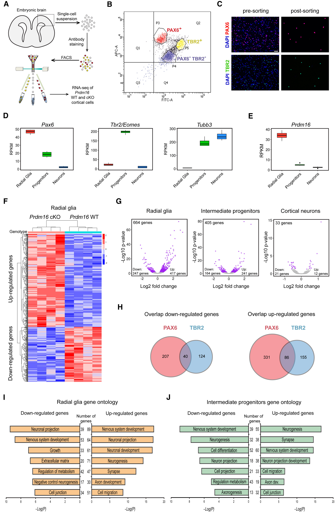

In this lesson we will introduce the cowplot package, which is very useful for aligning and arranging images into publication-quality figures. It's a versatile package with a lot of functionality to ease in the assembly of figures. Our goal in this lesson is to create the boxplot figures (4D & 4E) as they appear in the publication.

<p align="center">

</p>


We have already the Pax6 boxplot to match the publication, while providing some enhancements for the color palettes. However, if we want to create the figures above, we need to create the other three boxplots for Tbr2, Tubb3, and Pdrm16. Let's create these plots using code similar to the Pax6 boxplot, but changing the aesthetics to correspond to the appropriate gene data and the title to reflect the correct genes. Also, to incorporate all boxplot images into a figure, we need to save them to variables/objects in our environment.

```r
# Re-factor the levels to correspond to the same order as the Pax6 plot
eomes_exp$group <- factor(eomes_exp$group, levels = c("Pax6:WT", "Tbr2:WT", "neg:WT"))

tubb3_exp$group <- factor(tubb3_exp$group, levels = c("Pax6:WT", "Tbr2:WT", "neg:WT"))

prdm16_exp$group <- factor(prdm16_exp$group, levels = c("Pax6:WT", "Tbr2:WT", "neg:WT"))


# Create the ggplot2 objects
boxplot_pax6 <- ggplot(pax6_exp) +
  geom_boxplot(aes(x=group, 
                   y=normalized_counts, 
                   fill=group)) +
  ggtitle("Pax6") +
  personal_theme() +
  theme(axis.text.x = element_text(angle = 45, 
                                   vjust = 1, 
                                   hjust = 1)) +
  scale_x_discrete(name = "",
                   labels=c("Pax6:WT" = "Radial glia",
                            "neg:WT" = "Neurons", 
                            "Tbr2:WT" = "Progenitors")) +
  scale_y_continuous(name = "Normalized counts") +
  scale_fill_viridis(discrete = TRUE,
                     option = "viridis",
                     begin = 0.2 )

boxplot_tbr2 <- ggplot(eomes_exp) +
  geom_boxplot(aes(x=group, 
                   y=normalized_counts, 
                   fill=group)) +
  ggtitle("Tbr2/Eomes") +
  personal_theme() +
  theme(axis.text.x = element_text(angle = 45, 
                                   vjust = 1, 
                                   hjust = 1)) +
  scale_x_discrete(name = "",
                   labels=c("Pax6:WT" = "Radial glia",
                            "neg:WT" = "Neurons", 
                            "Tbr2:WT" = "Progenitors")) +
  scale_y_continuous(name = "Normalized counts") +
  scale_fill_viridis(discrete = TRUE,
                     option = "viridis",
                     begin = 0.2 )

boxplot_tubb3 <- ggplot(tubb3_exp) +
  geom_boxplot(aes(x=group, 
                   y=normalized_counts, 
                   fill=group)) +
  ggtitle("Tubb3") +
  personal_theme() +
  theme(axis.text.x = element_text(angle = 45, 
                                   vjust = 1, 
                                   hjust = 1)) +
  scale_x_discrete(name = "",
                   labels=c("Pax6:WT" = "Radial glia",
                            "neg:WT" = "Neurons", 
                            "Tbr2:WT" = "Progenitors")) +
  scale_y_continuous(name = "Normalized counts") +
  scale_fill_viridis(discrete = TRUE,
                     option = "viridis",
                     begin = 0.2 )

boxplot_prdm16 <- ggplot(prdm16_exp) +
  geom_boxplot(aes(x=group, 
                   y=normalized_counts, 
                   fill=group)) +
  ggtitle("Prdm16") +
  personal_theme() +
  theme(axis.text.x = element_text(angle = 45, 
                                   vjust = 1, 
                                   hjust = 1)) +
  scale_x_discrete(name = "",
                   labels=c("Pax6:WT" = "Radial glia",
                            "neg:WT" = "Neurons", 
                            "Tbr2:WT" = "Progenitors")) +
  scale_y_continuous(name = "Normalized counts") +
  scale_fill_viridis(discrete = TRUE,
                     option = "viridis",
                     begin = 0.2 )
```

Now that we have all of the boxplots saved as ggplot2 objects, we can specify how to order them into a figure using cowplot's `plot_grid()` function. This function has many arguments which can customize the arrangement of the plots, and we will specify that we would like the Pax6, Tbr2, and Tubb3 plots displayed as an image in a single row with three columns.

```r
library(cowplot)

# Arranging multiple plots in a figure
boxplot_grid <- plot_grid(boxplot_pax6,
                          boxplot_tbr2,
                          boxplot_tubb3,
                          ncol = 3)
boxplot_grid
```

<p align="center">

</p>

We completed our first figure. Now how do we save it to file?

<Add material from our 'Exporting images' lesson. Should add `ggsave()` information - nice that you can specify figure output type and resolution in single function [https://ggplot2.tidyverse.org/reference/ggsave.html](https://ggplot2.tidyverse.org/reference/ggsave.html) >

```r
# # Export to size width = 1200, height = 290
# pdf(file = "results/boxplot_figure.pdf",
#     width = 6,
#     height = 3)
# boxplot_grid
# dev.off()
```

Now that we have the figures for 4D and 4E, we can use cowplot to bring in the outside images to re-create the entire top half of the image displayed below. We can use the `png` package to read in png images (there are corresponding packages for tiff, pdf, and svg, eps?), then utilize a couple of additional cowplot functions to add the image as part of a larger image, while allowing for extensive customization. 

```r
#### REMOVE CODE

# Reading in png images from outside analyses (e.g. microscopy, FACS, cartoons)
fig4a <- readPNG("data/PP_fig4A.png")
fig4b <- readPNG("data/PP_fig4B.png")
fig4c <- readPNG("data/PP_fig4C.png")
```
***PLEASE READ*** *** draw_image is working without having to read in figure ****

Now that we have the images read into R, we can render them properly using the cowplot functions `ggdraw()` and `draw_image()`. The `ggdraw()` function creates a canvas to 'draw' on, while the `draw_image()` function draws the image onto some location on the canvas. 

> _**NOTE:** For more extensive image processing, the [`magick` package](https://cran.r-project.org/web/packages/magick/vignettes/intro.html) provides extensive functionality, and is called by the cowplot package for reading in the images._

```r
# Generate image variables for each of the image files
fig4a <- ggdraw() +
  draw_image("data/PP_fig4A.png")

fig4b <- ggdraw() +
  draw_image("data/PP_fig4B.png")

fig4c <- ggdraw() +
  draw_image("data/PP_fig4C.png")
```

We can see that reading in the image allowed proper rendering:

```r
fig4a
```

<p align="center">

</p>

Now we can use the `align_plots()` function again to combine all of our finished figures. We would like our images to be vertically aligned (we will align by the left axis, but should be similar for any axis chosen), so before we arrange our image, we use the `align_plots()` function. This function will create a list of vertically aligned images.

```r
# Align all images vertically for the top half of the figure
top_half <- align_plots(fig4a, fig4b, fig4c, boxplot_grid, boxplot_prdm16, 
                        align = 'v', 
                        axis = 'l')
```

Let's give the list components intuitive names for when we align our plot.

```r
names(top_half) <- c("fig4a", "fig4b", "fig4c", "fig4d", "fig4e")
```

To create the figure, we can use the `plot_grid() function again. However, we have to have the same number of rows or columns in the data to combine. Since the first row has three images (columns) and the second has two, we will create the figure row by row, then combine those rows into the full top half. 

Let's create the top row with the three equally-sized images that we just read in and provide figure labels.

```r
# Arrange first row of figure
first_row <- plot_grid(
  top_half$fig4a, top_half$fig4b, top_half$fig4c,
  labels = c("A", "B", "C"),
  nrow = 1)
```

Now we can finish the second row with our boxplots; however, 4E is about a third of the size of 4D. Luckily, within the `plot_grid()` function, we can specify the relative sizes of our figures; we will use the `rel_widths` argument.

```r
# Arrange second row of figure
second_row <- plot_grid(
  top_half$fig4d, top_half$fig4e,
  labels = c("D", "E"),
  rel_widths = c(1, .3),
  nrow = 1)
```

Now we can combine the first and second rows to create the full top half.

```r
# Create top half of figure
plot_grid(first_row, second_row, 
          ncol = 1)
```

We need to save this to a variable for us to combine later with the bottom half.

```r
top_half <- plot_grid(first_row, second_row, 
                      ncol = 1)
```

<p align="center">

</p>

> _**NOTE:** Another type of plot alignment is referred to as facetting, that is when you use data from the same data frame to create separate plots based on the values from one of the columns in the data frame. If we had wrangled our data to have the Pax6, Tbr2/Eomes, Tubb3 expression data all together in a single data frame, we could have used the facetting to create separate plots. Code to do this below? or just link out to ggplot2 book facetting._
