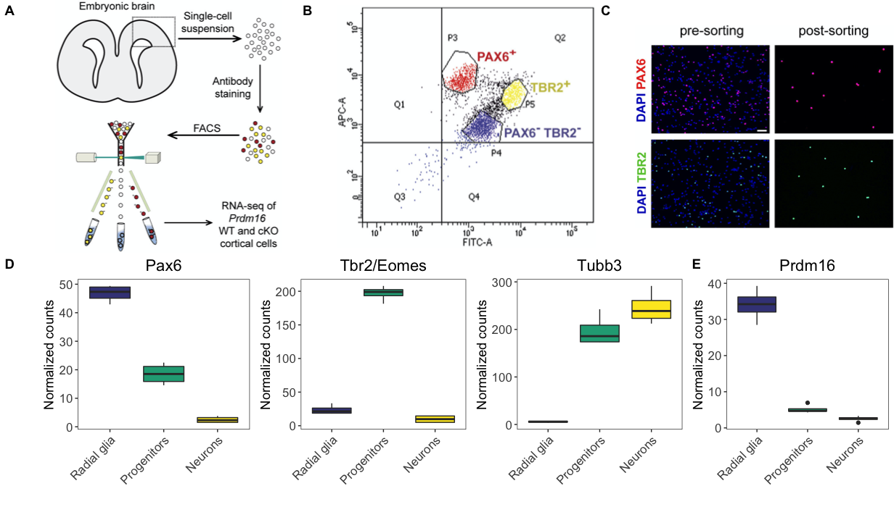
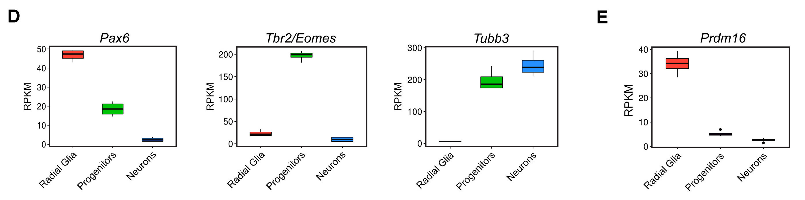
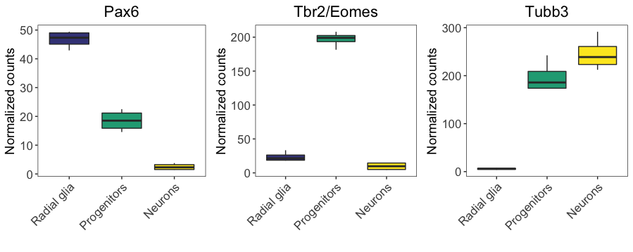

# Aligning plots using cowplot

In this lesson, we will introduce `cowplot`, a powerful package for aligning and arranging images into publication-quality figures. It's a versatile package with a lot of functionality to ease in the assembly of figures. Our goal in this lesson is to create the top half of the figure as is appears in the [publication](https://els-jbs-prod-cdn.jbs.elsevierhealth.com/cms/attachment/728f6fe8-d0ac-4893-ac8d-535469a2a1d1/gr4.jpg).

<p align="center">

</p>

## Boxplots

We have already plotted the *Pax6* boxplot to match the publication, while providing some enhancements for the color palettes. However, if we want to create the second row of the figure above, we need to create the other three boxplots for *Tbr2*, *Tubb3*, and *Pdrm16*. 

<p align="center">

</p>

Let's create these plots using similar code as to the *Pax6* boxplot, but modifying the aesthetics to match the corresponding gene data and title. Also, to incorporate all boxplot images into a figure, we need to save them to variables/objects in our environment.

```r
# Re-factor the levels to correspond to the same order as the Pax6 plot
eomes_exp$group <- factor(eomes_exp$group, levels = c("Pax6:WT", "Tbr2:WT", "neg:WT"))

tubb3_exp$group <- factor(tubb3_exp$group, levels = c("Pax6:WT", "Tbr2:WT", "neg:WT"))

prdm16_exp$group <- factor(prdm16_exp$group, levels = c("Pax6:WT", "Tbr2:WT", "neg:WT"))


# Create the ggplot2 objects

## object for pax6
boxplot_pax6 <- ggplot(pax6_exp) +
  geom_boxplot(aes(x=group, 
                   y=normalized_counts, 
                   fill=group)) +
  ggtitle("Pax6") +
  personal_theme() +
  theme(axis.text.x = element_text(angle = 45, 
                                   vjust = 1, 
                                   hjust = 1)) +
  scale_x_discrete(name = "",
                   labels=c("Pax6:WT" = "Radial glia",
                            "neg:WT" = "Neurons", 
                            "Tbr2:WT" = "Progenitors")) +
  scale_y_continuous(name = "Normalized counts") +
  scale_fill_viridis(discrete = TRUE,
                     option = "viridis",
                     begin = 0.2 )

## object for tbr2
boxplot_tbr2 <- ggplot(eomes_exp) +
  geom_boxplot(aes(x=group, 
                   y=normalized_counts, 
                   fill=group)) +
  ggtitle("Tbr2/Eomes") +
  personal_theme() +
  theme(axis.text.x = element_text(angle = 45, 
                                   vjust = 1, 
                                   hjust = 1)) +
  scale_x_discrete(name = "",
                   labels=c("Pax6:WT" = "Radial glia",
                            "neg:WT" = "Neurons", 
                            "Tbr2:WT" = "Progenitors")) +
  scale_y_continuous(name = "Normalized counts") +
  scale_fill_viridis(discrete = TRUE,
                     option = "viridis",
                     begin = 0.2 )

## object for tubb3
boxplot_tubb3 <- ggplot(tubb3_exp) +
  geom_boxplot(aes(x=group, 
                   y=normalized_counts, 
                   fill=group)) +
  ggtitle("Tubb3") +
  personal_theme() +
  theme(axis.text.x = element_text(angle = 45, 
                                   vjust = 1, 
                                   hjust = 1)) +
  scale_x_discrete(name = "",
                   labels=c("Pax6:WT" = "Radial glia",
                            "neg:WT" = "Neurons", 
                            "Tbr2:WT" = "Progenitors")) +
  scale_y_continuous(name = "Normalized counts") +
  scale_fill_viridis(discrete = TRUE,
                     option = "viridis",
                     begin = 0.2 )

## object for prdm16
boxplot_prdm16 <- ggplot(prdm16_exp) +
  geom_boxplot(aes(x=group, 
                   y=normalized_counts, 
                   fill=group)) +
  ggtitle("Prdm16") +
  personal_theme() +
  theme(axis.text.x = element_text(angle = 45, 
                                   vjust = 1, 
                                   hjust = 1)) +
  scale_x_discrete(name = "",
                   labels=c("Pax6:WT" = "Radial glia",
                            "neg:WT" = "Neurons", 
                            "Tbr2:WT" = "Progenitors")) +
  scale_y_continuous(name = "Normalized counts") +
  scale_fill_viridis(discrete = TRUE,
                     option = "viridis",
                     begin = 0.2 )
```

Now that we saved all boxplots as `ggplot2` objects, we can specify how to order them into a figure using cowplot's `plot_grid()` function. This function has many arguments that could customize the arrangement of the plots. We will specify that we would like the *Pax6*, *Tbr2*, and *Tubb3* plots displayed as an image in a single row with three columns.

```r
library(cowplot)

# Arranging multiple plots in a figure
boxplot_grid <- plot_grid(boxplot_pax6,
                          boxplot_tbr2,
                          boxplot_tubb3,
                          ncol = 3)
boxplot_grid
```

<p align="center">

</p>

We now have Figure 4D! What if we wanted to save this to file? 

The `ggplot2` package has a nice function called [`ggsave()`](https://ggplot2.tidyverse.org/reference/ggsave.html), which will, by default, save the last plot created. The function allows you to specify the resolution and the type of graphics output desired, with choices "eps", "ps", "tex" (pictex), "pdf", "jpeg", "tiff", "png", "bmp", "svg" or "wmf". Resolution for printed figures should usually be at least `dpi` of 300. Also handy are the options to choose the width, height, and the units for those specifications. Let's use `ggsave()` to save our boxplot figure to a pdf file.

```r
# Save plot to pdf
ggsave(plot = boxplot_grid,
       filename = "results/boxplot_figure.pdf",
       device = "pdf",
       width = 6,
       units = "in",
       dpi = 300)
```

> _**NOTE:** There are output-specific functions, such as `png()` and `pdf()`, which can be used to output the corresponding plots by writing directly to a graphics device. This can be much easier for saving more than a single image to the output file, and we have [materials available](https://hbctraining.github.io/Intro-to-R-flipped/lessons/13_exporting_data_and_plots.html#exporting-figures-to-file) for using these methods._

## Putting the top half of the figure together

Now that we have the figures for 4D and 4E, we can use cowplot to bring in the images created outside R, and re-create the entire top half of the image displayed above. All the images you need to bring in are in your `results` directory.

We will first render the these external images properly using the cowplot functions `ggdraw()` and `draw_image()`. The `ggdraw()` function creates a canvas to 'draw' on, while the `draw_image()` function draws the image onto some location on the canvas. 

> _**NOTE:** For more extensive image processing, the [`magick` package](https://cran.r-project.org/web/packages/magick/vignettes/intro.html) provides extensive functionality, and is called by the cowplot package for reading in the images._

```r
# Generate image variables for each of the image files
fig4a <- ggdraw() +
  draw_image("results/PP_fig4A.png")

fig4b <- ggdraw() +
  draw_image("results/PP_fig4B.png")

fig4c <- ggdraw() +
  draw_image("results/PP_fig4C.png")
```

We can see that reading in the image allowed proper rendering:

```r
fig4a
```

<p align="center">

</p>

Now we can use the `align_plots()` function to combine and align all of our finished figures into a list. We would like our images to be vertically aligned (`v` option), and to be aligned by the left axis (`l` option). This function will create a list of vertically aligned images.

```r
# Align all images vertically for the top half of the figure
top_half <- align_plots(fig4a, fig4b, fig4c, boxplot_grid, boxplot_prdm16, 
                        align = 'v', 
                        axis = 'l')
```

Let's give the list components intuitive names to help in later steps.

```r
names(top_half) <- c("fig4a", "fig4b", "fig4c", "fig4d", "fig4e")
```

To create the final figure, we can use the `plot_grid()` function again. However, we have to have the same number of rows or columns in the data to combine. Since the first row has three images (columns) and the second row has two, we will create the figure row by row, and then combine those rows into the full top half. 

In this exercise we are combining our figures to complete a full page. To ensure proper rendering of our image, it is helpful to save it to the final width and and height desired in the final figure. To ensure proper rendering, we will save each of our rows to file with a consistent width of '8.5', but different journals will have different requirements. 

Let's create the top row with the three equally-sized images that we just read in and provide figure labels.

```r
# Arrange first row of figure
first_row <- plot_grid(
  top_half$fig4a, top_half$fig4b, top_half$fig4c,
  labels = c("A", "B", "C"),
  nrow = 1)
  
# Save first row to file with constant width
ggsave(filename = "results/fig4ABC.png", 
       plot = first_row,
       units = "in", 
       width = 8.5,
       height = 13/4,
       dpi = 500)
```

Now we can finish the second row with our boxplots; however, 4E is about a third of the size of 4D. Luckily, within the `plot_grid()` function, we can specify the relative sizes of our figures; we will use the `rel_widths` argument.

```r
# Arrange second row of figure
second_row <- plot_grid(
  top_half$fig4d, top_half$fig4e,
  labels = c("D", "E"),
  rel_widths = c(1, .3),
  nrow = 1)

# Save second row to file with constant width
ggsave(filename = "results/fig4DE.png", 
       plot = second_row,
       units = "in", 
       width = 8.5,
       height = 13/5,
       dpi = 500)  
```

Now we can see how the full top half appears after combining the first and second rows.

```r
# Create top half of figure
plot_grid(first_row, second_row, 
          ncol = 1)
```

<p align="center">

</p>

> _**NOTE:** Another type of plot alignment is referred to as facetting, that is when you use data from the same data frame to create separate plots based on the values from one of the columns in the data frame. If we had wrangled our data to have the Pax6, Tbr2/Eomes, Tubb3 expression data all together in a single data frame, we could have used the facetting to create separate plots. Here are some examples of [facetting](https://ggplot2.tidyverse.org/reference/facet_grid.html)._
