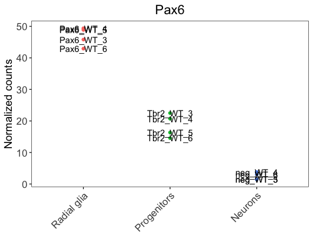
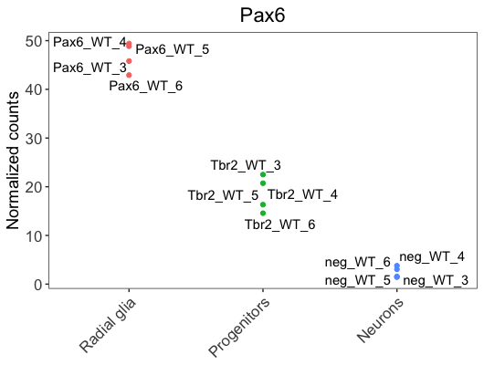
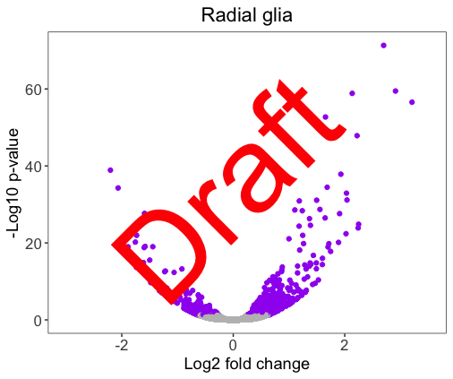
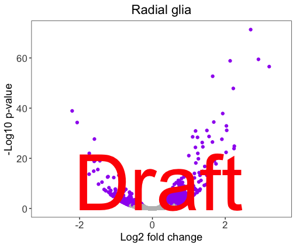
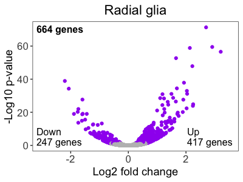
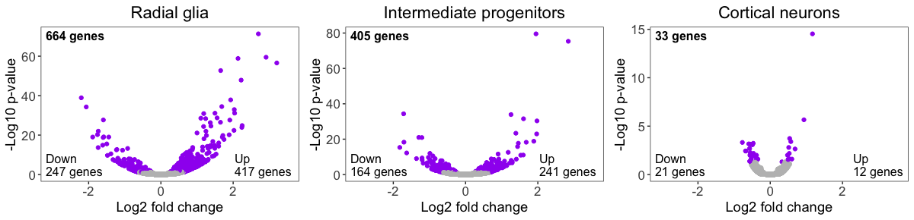
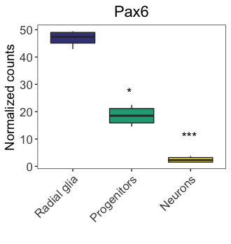
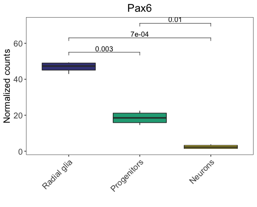
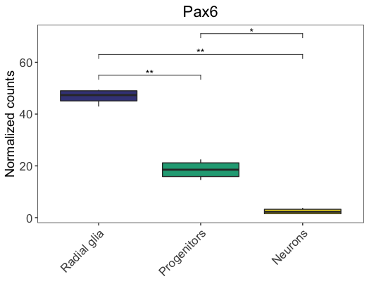

# Adding text annotations

In this lesson, we will learn how to add text annotations to a plot. There are a few popular types of annotations to add to plots. These include:

- Labeling all values
- Adding custom text
- Adding statistical comparison results

## Labeling all values

If you would like to label all values on the plot, this can easily be done by adding another layer to the ggplot with `geom_text()` or `geom_label()`. The ggplot2 book provides a [nice resource](https://ggplot2.tidyverse.org/reference/geom_text.html) for exploring the functionality of these geoms.

```r
# Adding labels to all values with geom_text
ggplot(pax6_exp) +
  geom_point(aes(x=group, 
                   y=normalized_counts, 
                   color=group)) +
  geom_text(aes(x=group, 
                y=normalized_counts,
                label=samples)) +
  ggtitle("Pax6") +
  personal_theme() +
  theme(axis.text.x = element_text(angle = 45, 
                                   vjust = 1, 
                                   hjust = 1)) +
  scale_x_discrete(name = "",
                   labels=c("Pax6:WT" = "Radial glia",
                            "neg:WT" = "Neurons", 
                            "Tbr2:WT" = "Progenitors")) +
  scale_y_continuous(name = "Normalized counts")
```

<p align="center">

</p>

We notice that labels overlap with the data points, making it hard to visualize. To solve the issue, we could use the `ggrepel`, a ggplot2 extension package that is helpful to prevent the overlap of labels. It can be added as a layer, similar to `geom_text`.

```r
library(ggrepel)

ggplot(pax6_exp) +
  geom_point(aes(x=group, 
                   y=normalized_counts, 
                   fill=group)) +
  geom_text_repel(aes(x=group, 
                y=normalized_counts,
                label=samples)) +
  ggtitle("Pax6") +
  personal_theme() +
  theme(axis.text.x = element_text(angle = 45, 
                                   vjust = 1, 
                                   hjust = 1)) +
  scale_x_discrete(name = "",
                   labels=c("Pax6:WT" = "Radial glia",
                            "neg:WT" = "Neurons", 
                            "Tbr2:WT" = "Progenitors")) +
  scale_y_continuous(name = "Normalized counts") +
  scale_fill_viridis(discrete = TRUE,
                     option = "viridis",
                     begin = 0.2 )
```                     


<p align="center">

</p>


## Adding custom text

Let's adding some custom text to our plot by finishing up the volcano plots we created previously. Here is the current volcano plot for Pax6.

```r
# Pax6 volcano plot
volcano_RG
```

<p align="center">

</p> 


Previously, we used `cowplot` to align plots and draw images. We can also use additional functionality from the `cowplot` package, `draw_label()` function, to add custom text to our figures. We will use the `ggdraw()` function to draw the ggplot2 image to the canvas, and then the `draw_label()` function to add the text on top. 

Let's practice by adding 'Draft' on top of our volcano plot. We can customize the appearance of the text within the `draw_label()` function. 

```r
# Explore the arguments for draw_label
?draw_label
```

***

## Exercise

Customize the 'Draft' text appearance, so that the figure looks like below. Hint: you will need the below arguments from `draw_label()`: `color`, `size`, `angle`.

<p align="center">

</p>

<details>
  <summary>Solution</summary>
  
  ```r
  # Practicing adding custom text to images
  ggdraw(volcano_RG) + 
    draw_label("Draft", 
               color = "#FF0000", 
               size = 100, 
               angle = 45)
  ```
  
</details>


***

We could also specify the x- and y-coordinates for where we would like the labels to appear on the image. The coordinates span from 0 to 1, with (0,0) located at the lower left-hand corner. We would need some trial and error to put the label to the desired position.

Center the 'Draft' in the mid-bottom of the image. **The x- and y-coordinates appropriate may be different, depending on the size of your plotting window.** 

```r
# Use the x, y, hjust and vjust arguments to center the text
ggdraw(volcano_RG) + 
  draw_label("Draft", 
             color = "#FF0000", 
             size = 100, 
             angle = 0,
             x = 0.25,
             y = 0.15,
             hjust = 0,
             vjust = 0)
```


<p align="center">

</p>


Now that we know how to add text to an image, let's add the annotations to our volcano plot to match the published figure.


```r
# Add annotations to the RG volcano plot

ggdraw(volcano_RG) + 
  draw_label("664 genes", 
             x = 0.15, 
             y = 0.82,
             size = 12,
             hjust = 0,
             vjust = 0,
             fontface = "bold") +
  draw_label("Down \n247 genes", 
             x = 0.15,
             y = 0.2,
             size = 12,
             hjust = 0,
             vjust = 0) +
  draw_label("Up \n417 genes", 
             x = 0.77,
             y = 0.2,
             size = 12,
             hjust = 0,
             vjust = 0)  
```

<p align="center">

</p>

To compile the whole figure, we first save each of the annotated volcano plots to variables.

```r
# Create annotations for all desired volcano plots, and save them to variables

## 1st plot
volcano_panel1 <- ggdraw(volcano_RG) + 
  draw_label("664 genes", 
             x = 0.15, 
             y = 0.82,
             size = 12,
             hjust = 0,
             vjust = 0,
             fontface = "bold") +
  draw_label("Down \n247 genes", 
             x = 0.15,
             y = 0.2,
             size = 12,
             hjust = 0,
             vjust = 0) +
  draw_label("Up \n417 genes", 
             x = 0.77,
             y = 0.2,
             size = 12,
             hjust = 0,
             vjust = 0)  

## 2nd plot
volcano_panel2 <- ggdraw(volcano_IP) + 
  draw_label("405 genes", 
             x = 0.15, 
             y = 0.82,
             size = 12,
             hjust = 0,
             vjust = 0,
             fontface = "bold") +
  draw_label("Down \n164 genes", 
             x = 0.15,
             y = 0.2,
             size = 12,
             hjust = 0,
             vjust = 0) +
  draw_label("Up \n241 genes", 
             x = 0.77,
             y = 0.2,
             size = 12,
             hjust = 0,
             vjust = 0)  

## 3rd plot
volcano_panel3 <- ggdraw(volcano_neu) + 
  draw_label("33 genes", 
             x = 0.15, 
             y = 0.82,
             size = 12,
             hjust = 0,
             vjust = 0,
             fontface = "bold") +
  draw_label("Down \n21 genes", 
             x = 0.15,
             y = 0.2,
             size = 12,
             hjust = 0,
             vjust = 0) +
  draw_label("Up \n12 genes", 
             x = 0.8,
             y = 0.2,
             size = 12,
             hjust = 0,
             vjust = 0)  
```

We then align these variables using `plot_grid()` from the `cowplot` package, and save the image.

```r
# Align volcano plots
volcano_grid <- plot_grid(volcano_panel1,
                          volcano_panel2,
                          volcano_panel3,
                          ncol = 3)

# Save as image
ggsave(plot = volcano_grid,
       filename = "results/fig4G.png",
       width = 8.5/3*2,
       dpi = 500)
```

<p align="center">

</p>


## Adding statistical comparisons

We could add statistical comparisons similar to annotating custom text as above. Let's take our Pax6 boxplot (`boxplot_pax6`) as an example. We could add statistical annotations by using the `ggdraw()` and `draw_label()` functions:

```r
# Drawing significance on plots
ggdraw(boxplot_pax6) +
  draw_label("***",
             x = 0.82,
             y = 0.44) +
  draw_label("*",
             x = 0.58,
             y = 0.62)
```

<p align="center">

</p>


The above code achieves our goal, but it requires some trial and error with x- and y-coordinates. Alternatively, the `ggpubr` package allows a quicker and easier method to add statistical annotations to a plot. The `ggpubr` package extends ggplot2's functionality and provides statistical comparisons between groups and customizable annotations.

Let's explore how we could use `ggpubr`, `stat_pvalue_manual()` function specifically, to add pre-computed statistical annotations to our boxplot. The `stat_pvalue_manual()` function can be added to a ggplot2 figure as a layer. This function requires the `x` and `y` arguments of the aesthetics (`aes()`) to be specified in the `ggplot()` layer, which applies to all mappings (including `stat_pvalue_manual()`) in the plot. However, we cannot include `fill` argument in the `ggplot()` layer (otherwise it will raise error message). So we will leave the `fill` argument within the `geom_boxplot` layer.

First, let's create the 'stat.test' to add to the figure. The table requires the columns `group1`, `group2`, and `p.adj` at the minimum. We will also include `p.adj.signif` for later use. [This resource](https://www.datanovia.com/en/blog/ggpubr-how-to-add-p-values-generated-elsewhere-to-a-ggplot/) has additional information about other columns that can be added.


```r
# Create ggpubr stat table
stat.test <- tibble::tribble(
  ~group1, ~group2,   ~p.adj, ~p.adj.signif,   
  "Pax6:WT",     "Tbr2:WT", 0.003, "**",
  "Pax6:WT",     "neg:WT", 0.0007, "**",
  "Tbr2:WT",     "neg:WT", 0.01, "*")

```

Now we can add the statistical annotations to the plot by adding the `stat_pvalue_manual()` function as a layer and specifying the stats table as the input. We also need to denote the name of the column to use as the source of annotations.

```r
# Load library for ggpubr
library(ggpubr)

# Add stats to plot
ggplot(pax6_exp, 
       aes(x=group,
           y=normalized_counts)) +
  geom_boxplot(aes(fill=group)) +
  ggtitle("Pax6") +
  personal_theme() +
  theme(axis.text.x = element_text(angle = 45, 
                                   vjust = 1, 
                                   hjust = 1)) +
  scale_x_discrete(name = "",
                   labels=c("Pax6:WT" = "Radial glia",
                            "neg:WT" = "Neurons", 
                            "Tbr2:WT" = "Progenitors")) +
  scale_y_continuous(name = "Normalized counts") +
  scale_fill_viridis(discrete = TRUE,
                     option = "viridis",
                     begin = 0.2 ) +
  stat_pvalue_manual(
    stat.test,
    label = "p.adj",
    y.position = 55,
    step.increase = 0.15)
```

<p align="center">

</p>

> Note: In the above figure, we use the `y.position` argument to specify the absolute position of the first label, and then the `step.increase` argument to indicate the increase of height for every additional comparisons (to avoid annotation overlap). Alternatively, we could just specify the absolute positions of each label using a numeric vector. For example, check what you get if specifying `y.position = c(60, 30, 70)` (no `step.increase` argument is needed).


In the above figure, we annotated the absolute p-values. Alternatively, we could annotate the significance level, using the `p.adj.signif` column. We just need to specify the `label` argument as `p.adj.signif`, and keep everything else the same.

```r
# Add significance level to plot
ggplot(pax6_exp, 
       aes(x=group,
           y=normalized_counts)) +
  geom_boxplot(aes(fill=group)) +
  ggtitle("Pax6") +
  personal_theme() +
  theme(axis.text.x = element_text(angle = 45, 
                                   vjust = 1, 
                                   hjust = 1)) +
  scale_x_discrete(name = "",
                   labels=c("Pax6:WT" = "Radial glia",
                            "neg:WT" = "Neurons", 
                            "Tbr2:WT" = "Progenitors")) +
  scale_y_continuous(name = "Normalized counts") +
  scale_fill_viridis(discrete = TRUE,
                     option = "viridis",
                     begin = 0.2 ) +
  stat_pvalue_manual(
    stat.test,
    label = "p.adj.signif",
    y.position = 55,
    step.increase = 0.15)
```

<p align="center">

</p>

> Note: `ggpubr` has many more functionalities than what we covered here. If you are interested in learning more, please check this [tutorial](https://jtr13.github.io/cc20/brief-introduction-and-tutorial-of-ggpubr-package.html), as well as the [package webpage](https://rpkgs.datanovia.com/ggpubr/index.html).
