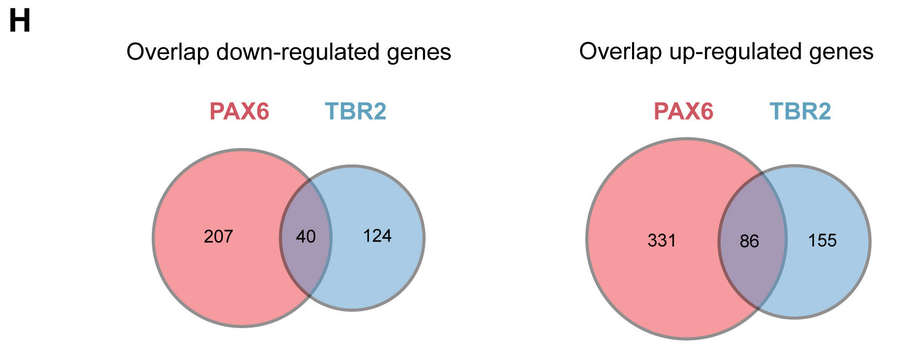
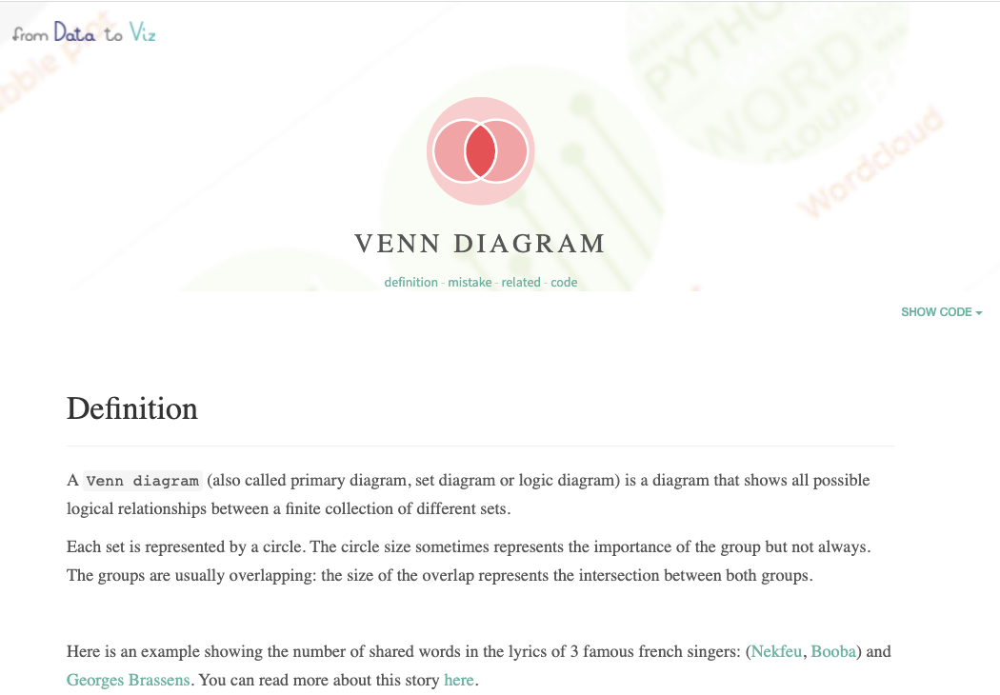
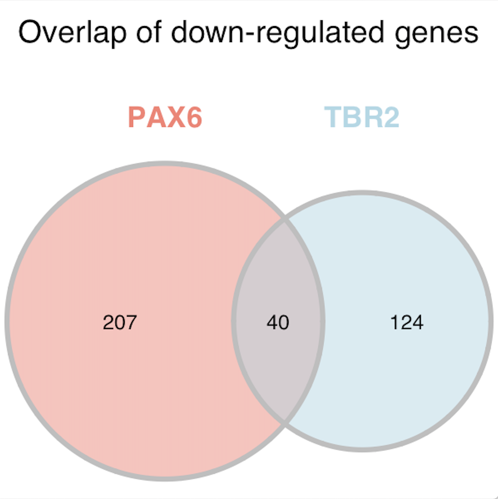
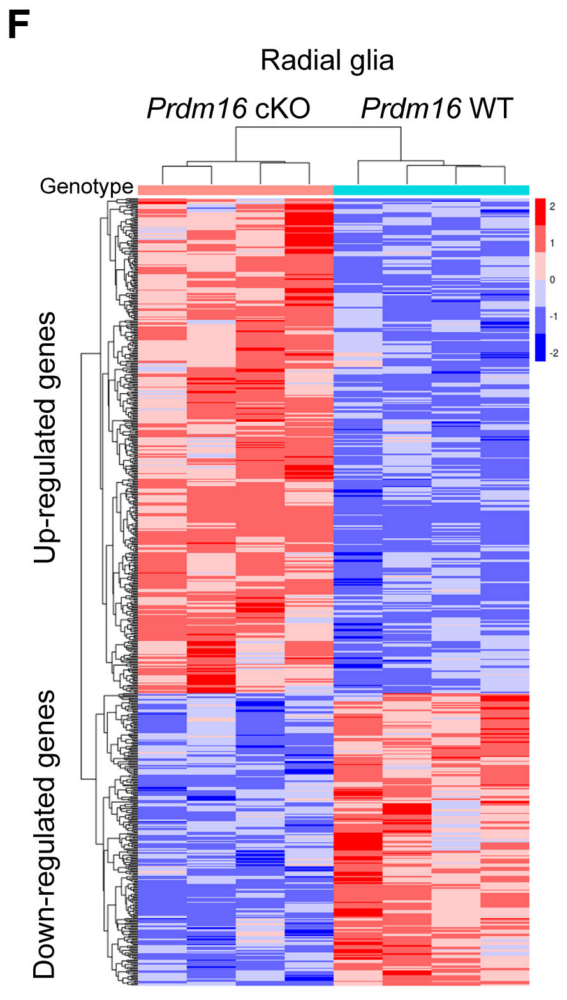
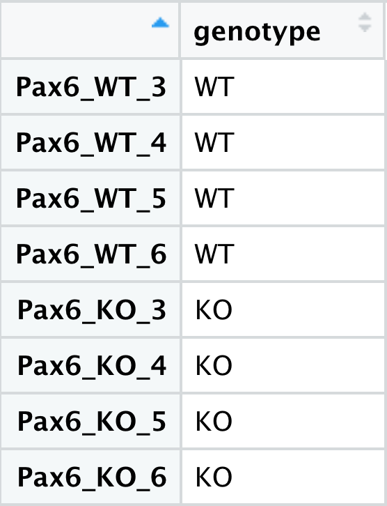
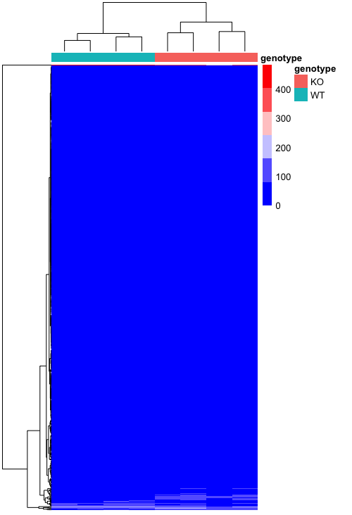
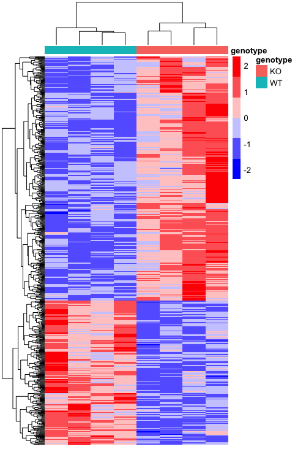
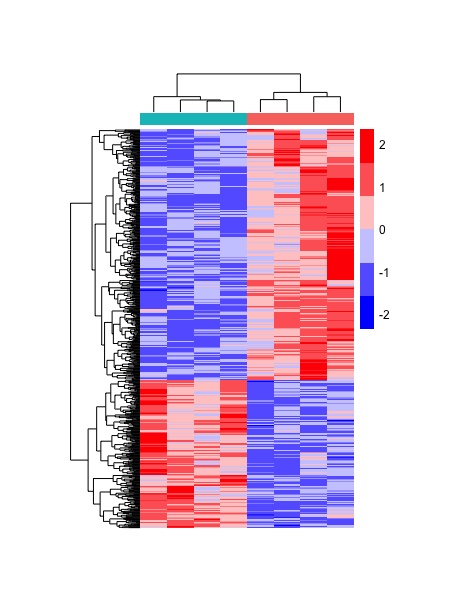
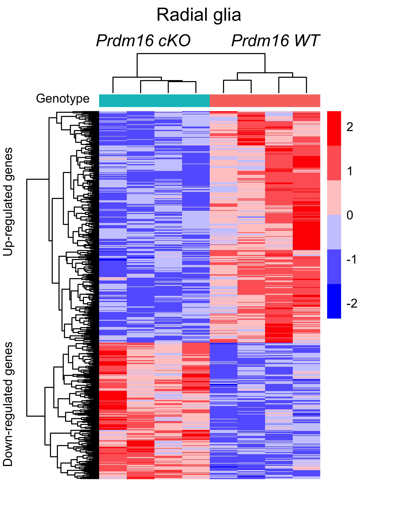

# External packages for figure creation

We have discovered that `ggplot2` has incredible functionality and versatility; however, it is not always the best choice for all graphics. There are a plethora of different packages that specialize in particular types of figures. The [Data to Viz resource](https://www.data-to-viz.com) provides popular packages for specialized plots along with the code to create them. 

## Visualizing overlaps of sets using Venn diagrams

Let's start by exploring how to create the Venn diagram in figure 4H. 

<p align="center">

</p>

  
A Venn diagram compares two or more lists, and by nature is categoric. If we use the [Data to Viz resource](https://www.data-to-viz.com), we can navigate to the `Categoric` data, and under 'Two independent lists' we find the Venn diagram. Clicking on the Venn diagram icon will open up a pop up window with a breif description of Venn diagrams. At the bottom of the pop up page, find the link to the "dedicated page"; explore the [dedicated page](https://www.data-to-viz.com/graph/venn.html).

<p align="center">

</p>


This page has a lot of nice information about Venn diagrams, as well as, suggestions for when to use them (e.g. generally not recommended for comparison of more than 3 sets - use [upset plots](https://jku-vds-lab.at/tools/upset/) instead). Since we are comparing two sets of data for each visualization (e.g. Pax6 and Tbr2-expressing samples), a Venn diagram is a recommended method.

Let's expand the 'Code', and note the package used to create the Venn diagrams is `VennDiagram`. We will use this package, as well. To create the Venn diagram, we need to generate our sets. We can subset our data for the `Pax6`- and `Tbr2`-expressing samples to only include those genes that are significant with `threshold` equal to `TRUE` and that are up-regulated using the `log2FoldChange` values > 0.

```r
library(VennDiagram)

# Up-regulated
up1 <- results[which(results$pax6_threshold & results$pax6_log2FoldChange > 0),]
up2 <- results[which(results$tbr2_threshold & results$tbr2_log2FoldChange > 0),]
```

We can do a similar subset for the down-regulated genes, but with `log2FoldChange` < 0.

```r
# Down-regulated
down1 <- results[which(results$pax6_threshold & results$pax6_log2FoldChange < 0),]
down2 <- results[which(results$tbr2_threshold & results$tbr2_log2FoldChange < 0),]
```

Now that we have our sets of genes that are up- and down-regulated in the respective conditions, we can check how many overlap between the conditions. This is a good check to perform to make sure the packages report the correct interaction numbers.

```r
# Check overlap for each of the different sets
length(which(row.names(up1) %in% row.names(up2)))
length(which(row.names(down1) %in% row.names(down2)))
```

To create the figures we first need to change the plots into lists. 

```r
# Create lists for comparison
up <- list(
  PAX6 = rownames(up1),
  TBR2 = rownames(up2))

down <- list(
  PAX6 = rownames(down1),
  TBR2 = rownames(down2))
```

Now to create a simple Venn diagram, we can use the `venn.diagram()` function from the `VennDiagram` package to create the graphics.

```r
venn.diagram(x = up, 
             filename = "results/venn_up.png",
             output = TRUE)
```

This has successfully created a Venn diagram, but this is not exactly a publication-quality figure. A nice feature of the VennDiagram package is the ability for extensive customization of the graphic. Let's explore all of the different arguments available for our Venn diagram.

```r
# Check customizable options for diagram
?venn.diagram
```

Running the examples from the help page can be quite illuminating when exploring the range of possibilities.

***
**Exercise?**

Was thinking the below code could be a possible answer key and for the exercise provided with empty arguments - we maybe don't need to include all of these options as its a bit overwhelming, but ask to fill in some of the arguments and add any additional ones that they choose?

Customize some of these options to output a figure similar to that in the paper.

```r
# Up-regulated genes
venn.diagram(x = up, 
             filename = "results/venn_up.png",
             category.names = c("PAX6" , "TBR2"),
             output = TRUE,
             main = "Overlap of up-regulated genes",
             main.fontfamily = "sans",
             main.cex = 0.75,
             height = 600 , 
             width = 600 , 
             resolution = 300,
             compression = "lzw",
             lwd = 2,
             col= "gray",
             fill = c("salmon", "lightblue"),
             cex = 0.5,
             fontfamily = "sans",
             cat.cex = 0.7,
             cat.fontface = "bold",
             cat.default.pos = "outer",
             cat.pos = 0,
             cat.dist = c(0.05,0.097),
             cat.fontfamily = "sans",
             cat.col = c("salmon", "lightblue"))
```

<p align="center">

</p>

```r
# Down-regulated genes
venn.diagram(x = down, 
             filename = "results/venn_down.png",
             category.names = c("PAX6" , "TBR2"),
             output = TRUE,
             main = "Overlap of down-regulated genes",
             main.fontfamily = "sans",
             main.cex = 0.75,
             height = 600 , 
             width = 600 , 
             resolution = 300,
             compression = "lzw",
             lwd = 2,
             col= "gray",
             fill = c("salmon", "lightblue"),
             cex = 0.5,
             fontfamily = "sans",
             cat.cex = 0.7,
             cat.fontface = "bold",
             cat.default.pos = "outer",
             cat.pos = 0,
             cat.dist = c(0.06,0.097),
             cat.fontfamily = "sans",
             cat.col = c("salmon", "lightblue"))
```

<p align="center">

</p>

***

## Visualizing numeric data from different conditions or groups
  
Specialized packages are also useful for the creation of the hierarchical heatmap figure in the publication. 
  
<p align="center">

</p>

  
The benefits gained from these specialized packages for the heatmap help by incorporating statistical information, such as providing the dendrograms and clustering of rows and/or columns. While ggplot2 can easily create a heatmap with `geom_tile()`, it cannot easily provide the hierarchical clustering allowed by these more customized packages. There are a few popular packages specializing in the generation of hierarchical heatmaps, including `pheatmap`, `d3heatmap`, and `ComplexHeatmap`, among others. We will explore the `pheatmap` package for our hierarchical clustering figure; however, additional information can be found for `d3heatmap` from [Data to viz](https://www.data-to-viz.com/graph/heatmap.html) and we have [additional materials](supp_complexHeatmap.md) highlighting the code to create the same plot using `ComplexHeatmap`. ComplexHeatmap definitely embraces its name, and there is a [whole book](https://jokergoo.github.io/ComplexHeatmap-reference/book/) dedicated to creating custom heatmaps using this package.

Generally, people use heatmaps to look compare numeric data from different conditions or groups. These comparisons range across different fields of study; for instance, a heatmap could be used to explore how temperatures have increased across the months of the year over the past 100 years or it could be used to explore the monthly earnings for all fortune 500 companies. We will use a heatmap to explore our biological data and look at the genes that have significantly different expression between mice with or without the *Prdm16* gene. The hierarchical clustering will add information to the figure about which mice are most similar to each other in the expression of these genes.

To create this figure, we first need to subset our gene expression data to the significant genes for the radial glia cells (_Pax6_-expressers). To get the names of our significant genes we can filter to only include those with significance (p-adjusted) values less than 0.05.
 
```r
# Get Pax6 sig genes
pax6_sig_genes <- results %>%
  rownames_to_column("ensembl_id") %>%
  filter(pax6_padj < 0.05) %>%
  pull(ensembl_id)
```

We are only interested in the radial glia, so we will extract only the `Pax6` samples.
  
```r
# Filter heatmap for only the radial glia (Pax6 samples)
heatmap_normCounts <- normalized_counts[ , colnames(normalized_counts)[str_detect(colnames(normalized_counts), "Pax6")]]
```
  
Then we can extract only the significant genes from our `Pax6` expression matrix. 

```r
# Filter for the sig genes
heatmap_normCounts <- heatmap_normCounts[which(rownames(heatmap_normCounts) %in% pax6_sig_genes), ]
```
  
Now we have the values to be included in the heatmap, but we also need to color it by group, `Prdm16` knockout or wildtype. To get that information, we need to use our metadata. We will extract the same mice samples from our metadata that we have the counts for, which is the `Pax6` samples.

We'll start by copying our full metadata table to a new variable to ensure we don't accidently alter our original metadata.
  
```r
# Copy metadata to new variable
heatmap_meta <- meta
```
 
Now to create the heatmap using the `pheatmap` package, the row names of our metadata need to be the sample names and match the column names of our counts (numeric) data.

```r
# Assign the sample names to be the row names
rownames(heatmap_meta) <- heatmap_meta$samples
```
  
Now we can subset the metadata to only include those samples present in the `Pax6` counts data.
  
```r
# Subset metadata to match samples in count data
heatmap_meta <- heatmap_meta[which(rownames(heatmap_meta) %in% colnames(heatmap_normCounts)), ]
```
  
We are only interested in using the genotype annotations, so we will keep only that column. All columns given to `pheatmap` for annotations will be included as separate bars.
  
```r
# Select only the genotype column for annotations
heatmap_meta <- heatmap_meta %>%
  select(genotype)
```
  
The factor levels for the genotype will determine the color automatically assigned to the group. We can manually specify the levels using the `factor()` function.
  
```r
# Re-level factors
heatmap_meta$genotype <- factor(heatmap_meta$genotype, levels = c("WT", "KO"))
```

<p align="center">

</p>

Now that we have the metadata with information for annotating the groups and the count data to be visually transformed into the heatmap, we only need to provide any customized colors to use in the heatmap and to denote the groups. We can specify the colors to use for the gradient in the numeric expression values:
  
```r
# Colors for heatmap
heatmap_colors <- colorRampPalette(c("blue", "white", "red"))(6)
```
 
Also, we can specify the colors to use to denote the annotations. The colors for the annotations need to be provided as a list:

```r
# Colors for denoting annotations
ann_colors <- list(genotype = c(KO = "#F8766D", WT = "#00BFC4"))
```

Now we can load the `pheatmap` library, using the `pheatmap()` function to create the heatmap.

```r
# Load library
library(pheatmap)

# Plot heatmap  
pheatmap(heatmap_normCounts, 
         color = heatmap_colors,
         annotation_col = heatmap_meta,
         annotation_colors = ann_colors,
         show_colnames = F, 
         show_rownames = F)
```

<p align="center">

</p>

We are have created a basic heatmap, but it's not very informative as it is. It looks like the expression of a lot of the genes is much lower than some of the others, so we can't see the differences very easily for the genes that don't have the highest values. There is a helpful argument called `scale` that allows us to scale the colors by the values in each row or column. Since each gene is a row, we will add this argument to be `scale = "row"`, which centers and scales the values.
  
```r
# Plot heatmap scaled by row
pheatmap(heatmap_normCounts, 
         color = heatmap_colors,
         annotation_col = heatmap_meta,
         annotation_colors = ann_colors,
         show_colnames = F, 
         show_rownames = F,
         scale="row")
```

<p align="center">

</p>

  
Now that looks a lot better! We can see clustering between the different groups, which is good since these genes are supposed to have different expression between the groups. We can add a few more arguments to make it look more like the figure, like deleting the annotation name and legend. We will also adjust the width and heigth of the tiles.

```r 
# Scaled heatmap with adjustments for figure
pheatmap(heatmap_normCounts, 
         color = heatmap_colors,
         annotation_col = heatmap_meta,
         annotation_colors = ann_colors,
         show_colnames = F, 
         show_rownames = F,
         scale="row",
         treeheight_col = 25,
         cellwidth = 20,
         cellheight = 0.4,
         annotation_names_col = F,
         annotation_legend = F)
```
  
<p align="center">

</p>

  
Now we are only missing the text annotations, and we can add using the `cowplot` package we learned about earlier. However, the pheatmap image is stored as a list rather than a graphics object. The `ggplotify` package allows us to manipulate this list object into a ggplot object with the `as.ggplot()` function, faciliatating further modifications with `ggplot2` or `cowplot`.

```r
# Load library
library(ggplotify)
  
# Turn into a ggplot object
heatmap <- as.ggplot(pheatmap(heatmap_normCounts, 
                              color = heatmap_colors,
                              cluster_rows = T, 
                              annotation_col = heatmap_meta,
                              annotation_colors = ann_colors,
                              border_color="white", 
                              cluster_cols = T, 
                              show_colnames = F, 
                              show_rownames = F,  
                              scale="row",
                              treeheight_col = 25,
                              cellwidth = 20,
                              cellheight = 0.40,
                              fontsize = 9,
                              annotation_names_col = F,
                              annotation_legend = F))
```

To add the annotations at the top and left sides of the plot, we will use the `theme()` function from `ggplot2` to add whitespace. With the `plot.margin` argument we can specify the amount of space to add to the top, right, bottom and left margins (in that order).           

```r          
# Adding white space to add annotations to the top, right, bottom, and left margins
heatmap <- heatmap + 
  theme(plot.margin = unit(c(1,0.5,0.5,0.5), "cm"))           
```
  
Now we can use `cowplot to add in our desired annotations to match the published figure below.
  
```r  
# Adding in annotations with cowplot 
heatmap_figure <- ggdraw(heatmap) +  
  draw_label("Radial glia", 
             x = 0.4, 
             y = 0.97,
             size = 14,
             hjust = 0,
             vjust = 0) +
  draw_label("Prdm16 cKO", 
             x = 0.24, 
             y = 0.91,
             size = 12,
             hjust = 0,
             vjust = 0,
             fontface = "italic") +
  draw_label("Prdm16 WT", 
             x = 0.58, 
             y = 0.91,
             size = 12,
             hjust = 0,
             vjust = 0,
             fontface = "italic") +
  draw_label("Up-regulated genes",
             angle = 90,
             size = 9,
             x = 0.03,
             y = 0.5,
             hjust = 0,
             vjust = 0) +
  draw_label("Down-regulated genes",
             angle = 90,
             size = 9,
             x = 0.03,
             y = 0.09,
             hjust = 0,
             vjust = 0) +
  draw_label("Genotype",
             size = 9,
             x = 0.09,
             y = 0.8,
             hjust = 0,
             vjust = 0)

heatmap_figure
```

                  
<p align="center">

</p>

Finally, we want to export the image so that it will display properly in our final figure.

```r                  
# Export as a tiff
ggsave(filename = "results/heatmap_figure_ggsave.tiff", 
       units = "in", 
       width = 4, 
       height = 5.15, 
       dpi = 500)                  
```
