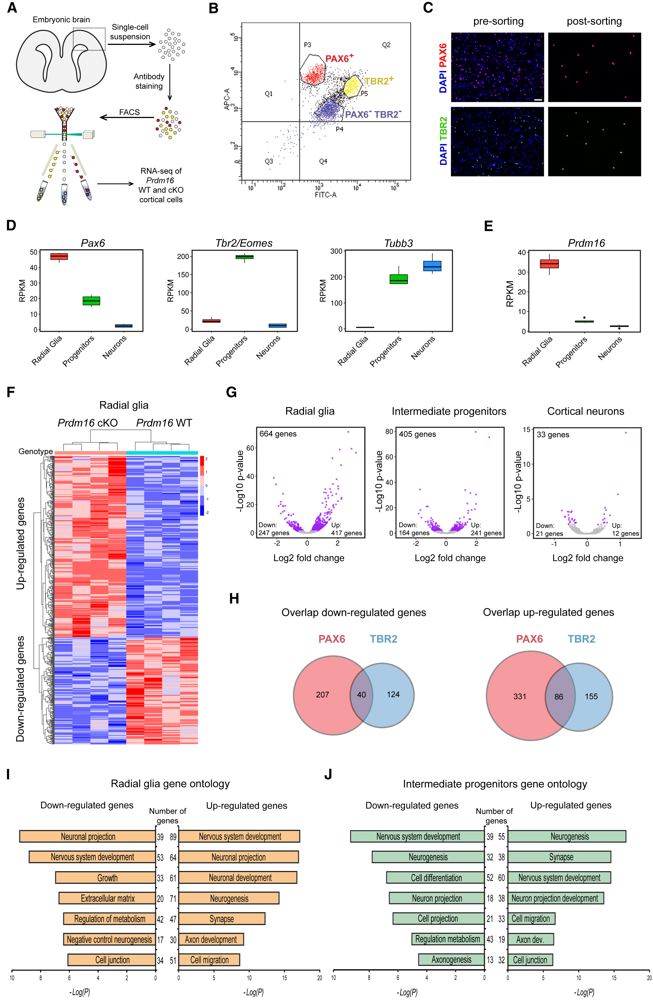
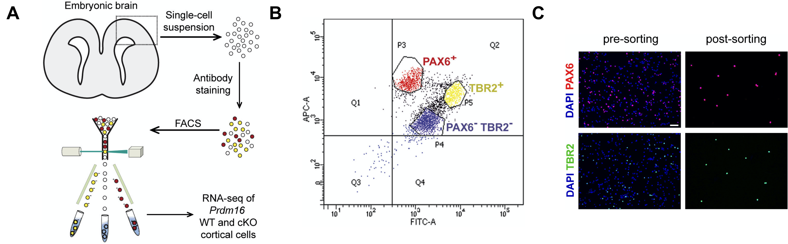
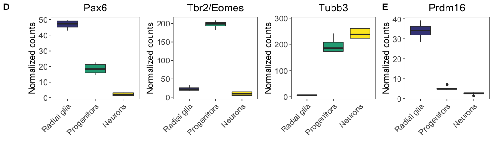
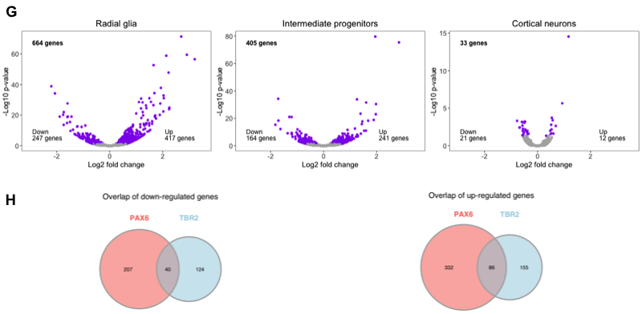

## Creating the final figure

Now we have created all graphics present in our published figure. We can use `cowplot` to add them together. Sometimes it is helpful to save the images for each of the rows to file with each being the same width so that the sizes in the figure are all the same. Therefore, our workflow will be:

  - Create each of the rows in the figure
  - Save each row to file with a standard width ()
  - Read each row image into R
  - Combine row graphics into full image

### Create each row of figure

The published figure below is what we are trying to reconstruct. 

<p align="center">

</p>

We have already created the first two rows, let's take a quick look at these and save them to file using a standard width of x.

Let's start by looking at the first row image.

```r
# Check first row figure
fig4abc <- ggdraw() +
  draw_image("results/fig4ABC.png")
  
fig4abc
```  

<p align="center">

</p>

```r
# Check second row figure
fig4de <- ggdraw() +
  draw_image("results/fig4DE.png")  
  
fig4de
```

<p align="center">

</p>

These rows look good and are both saved to our specified width. Now, we need to create the next row with parts F (heatmap), G (volcano plots), and H (Venn diagrams). To do this, we must first join the Venn diagrams into a single graphic. To join the Venn diagrams, we can read in the images that were output and plot them together in a single row with two columns. 

```r
# Create Figure 4H
fig4h_down <- ggdraw() +
  draw_image("results/venn_down.png")

fig4h_up <- ggdraw() +
  draw_image("results/venn_up.png")

fig4h <- plot_grid(fig4h_down,
                   fig4h_up,
                   ncol = 2)

# Check the figure
fig4h                   
```

<p align="center">

</p>

Now that we have the Venn diagrams as a single figure, we need to combine it with the volcano plot figure, which we saved to file to preserve the annotations in the correct locations. Let's read in the volcano figure and join in the Venn diagrams.

```r
# Read in Figure 4G
fig4g <- ggdraw() +
  draw_image("results/fig4G.png")

# Join with Figure 4H (Venn diagrams)
fig4gh_aligned <- align_plots(fig4g, fig4h,
                              align = 'h',
                              axis = 't')
                              
names(fig4gh_aligned) <- c("fig4g", "fig4h")

fig4gh <- plot_grid(fig4g,
                    fig4h,
                    ncol=1,
                    labels = c("G", "H"),
                    label_x = 0,
                    rel_heights = c(1.5,1))
                    
# Check the output
fig4gh
```

<p align="center">

</p>

Now to finish the row, we need to add the heatmap. We also saved this image to file to preserve the annotation locations. Let's read it in and add it to the rest of the row.

```r
# Read in Figure 4F
fig4f <- ggdraw() +
  draw_image("results/heatmap_figure.png")
  
# Combine images into the third row
fig4fgh <- plot_grid(fig4f,
                     fig4gh,
                     labels = c("F", ""),
                     rel_widths = c(0.7, 1),
                     nrow = 1)
                     
# Check output
fig4fgh

# Save image to file
ggsave(filename = "results/fig4FGH.png", 
       plot = fig4fgh,
       units = "in", 
       width = 8.5,
       height = 13/2.5,
       dpi = 500)
```

<p align="center">

</p>

The last row contains the bar plots of the gene ontology terms, which we left as a take-home exercise. Therefore, we have provided the images as part of your project to read in (however, you are welcome to work through the exercise and try this over with your own plots later).

Let's read in the images for the bar plots and create the last row.

```r
# Read in bar plot images
fig4i <- ggdraw() +
    draw_image("results/PP_fig4I.png")

fig4j <- ggdraw() +
  draw_image("results/PP_fig4J.png")

# Combine images into the last row
fig4ij <- plot_grid(fig4i,
                    fig4j,
                    labels = c("I", "J"),
                    nrow = 1)
                       
# Save image to file
ggsave(filename = "results/fig4IJ.png", 
       plot = fig4ij,
       units = "in", 
       width = 8.5,
       dpi = 500)                       
```

<p align="center">

</p>

Now we have all of our rows saved to the same width, let's read them in and add combine them into a figure.

```r
# Read in rows
fig4ABC <- ggdraw() +
  draw_image("results/fig4ABC.png")

fig4DE <- ggdraw() +
  draw_image("results/fig4DE.png")

fig4FGH <- ggdraw() +
  draw_image("results/fig4FGH.png")  

fig4IJ <- ggdraw() +
  draw_image("results/fig4IJ.png")


# Align rows
all_figs <- align_plots(fig4ABC, fig4DE, fig4FGH, fig4IJ,
            align = 'v', 
            axis = 'lr')

names(all_figs) <- c("fig4abc", "fig4de", "fig4fgh", "fig4ij")

# Arrange the rows of the figure
first_row <- plot_grid(
  all_figs$fig4abc,
  nrow = 1)

second_row <- plot_grid(
  all_figs$fig4de,
  nrow = 1)

third_row <- plot_grid(
  all_figs$fig4fgh,
  nrow = 1)

fourth_row <- plot_grid(
  all_figs$fig4ij,
  nrow = 1)
```

To combine the rows into a figure can be tricky. It's much easier if you have saved them at the desired width and height previously. We didn't save at the desired height for all images, so we may need to play around with the parameters, particularly the `rel_width` and `rel_height`. We have played around with these values to choose those most appropriate.

```r
# Combine images into the full figure
fig4complete <- plot_grid(first_row,
                          second_row,
                          third_row,
                          fourth_row,
                          ncol = 1,
                          align = 'v',
                          axis = 'lr',
                          rel_heights = c(0.8,0.64,1.27,0.88),
                          rel_widths = c(1,1,1,1))
                          
# Save final image
ggsave(filename = "results/figure4_completed.png",
       plot = fig4complete,
       width = 8.5,
       height = 13,
       units = "in",
       dpi = 500)
```

<p align="center">

</p>

Congratulations, you have completed the full figure!! 

Oftentimes, after looking at the completed figure, we may need to go back and tweak a few of the graphing parameters. For instance, the volcano plots appear quite small and the text seems illegible; we could alter the parameters for the size of the output and/or the size of the text. We left these just to show that the parameters are not always perfect on the first run through when trying to create an entire page of images.

