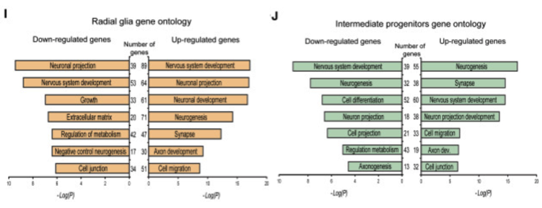
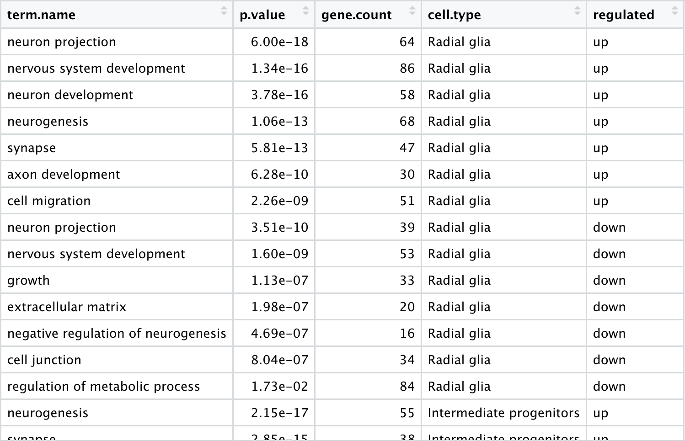
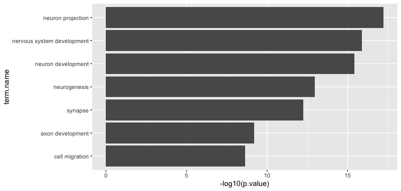
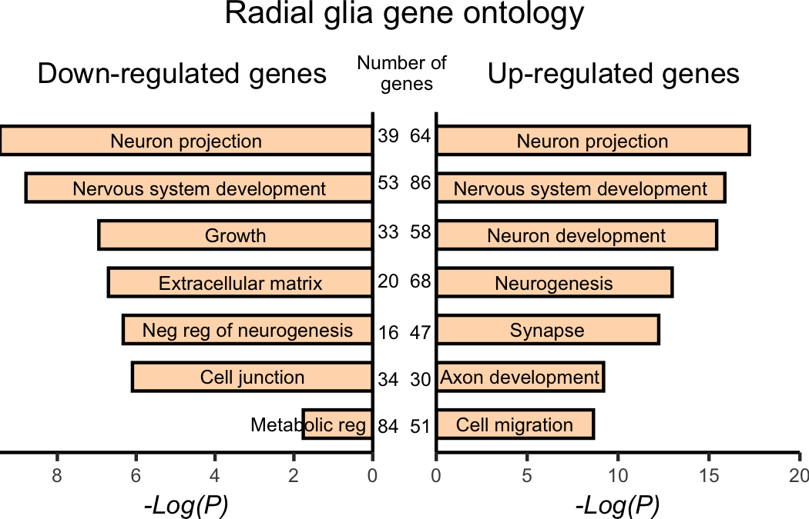

Now that we have learned the basics of ggplot2 and how to combine different images using `cowplot`, let's create the bar plot figures in the publication (Figs 4I and 4J). We will complete this as an exercise and have the answers available.


<p align="center">

</p>

## Set up
1. Let's read in our gene ontology data.

  ```r
  # Read in data for bar plot
  enriched_go_results <- read.csv("data/pp_gene_ontology_results.csv")
  ```
  
  <p align="center">
  
  </p>

  
2. Now, let's split the dataset into the Pax6 up-regulated, Pax6 down-regulated, Tbr2 up-regulated and Tbr2 down-regulated.
  
  ```r
  # Separate into the four datasets for the figure
  pax6_up_go <- enriched_go_results %>%
  filter(regulated == "up" & 
           cell.type == "Radial glia")

  pax6_down_go <- enriched_go_results %>%
    filter(regulated == "down" & 
             cell.type == "Radial glia")

  tbr2_up_go <- enriched_go_results %>%
    filter(regulated == "up" & 
             cell.type == "Intermediate progenitors")

  tbr2_down_go <- enriched_go_results %>%
    filter(regulated == "down" & 
             cell.type == "Intermediate progenitors")
  ```

3. Order the factor levels for the term names in the order you would like them to appear in the plot (from bottom to top) based on the `p.value`.

  ```r
  # Order terms
  ## Pax6 up
  pax6_up_order_levels <- pax6_up_go %>%
    arrange(p.value) %>%
    pull(term.name)

  pax6_up_go$term.name <- factor(pax6_up_go$term.name, 
                                 levels = rev(pax6_up_order_levels))
                                 
  ## Pax6 down
  pax6_down_order_levels <- pax6_down_go %>%
    arrange(p.value) %>%
    pull(term.name)

  pax6_down_go$term.name <- factor(pax6_down_go$term.name, 
                                 levels = rev(pax6_down_order_levels)) 
                                 
  ## Tbr2 up
  tbr2_up_order_levels <- tbr2_up_go %>%
    arrange(p.value) %>%
    pull(term.name)

  tbr2_up_go$term.name <- factor(tbr2_up_go$term.name, 
                                 levels = rev(tbr2_up_order_levels))       
                                 
  ## Tbr2 down
  tbr2_down_order_levels <- tbr2_down_go %>%
    arrange(p.value) %>%
    pull(term.name)

  tbr2_down_go$term.name <- factor(tbr2_down_go$term.name, 
                                   levels = rev(tbr2_down_order_levels))                                  
  ```

## Basic plot

4. Create a basic bar plot for the Pax6 up-regulated genes using `geom_col()`. Use the `coord_flip()` function as a layer to get the bars to go horizontally.

  <p align="center">
  
  </p>

<details>
  <summary>Solution</summary>
  
 <p><pre>
  # Create the base of the bar plot
  ggplot(pax6_up_go) +
    geom_col(aes(x = term.name, 
                 y = -log10(p.value))) + 
    coord_flip()
  </pre></p>
  
</details>
  

## Add layers

5. Alter the color of the bars to be yellowish-orange inside and black outside.
6. Remove the title of the flipped x-axis
7. For the flipped y-axis, do the following:
  - Change the title to be `"-Log(P)"`.
  - Set the limits to be 0 and 20.
  - Remove any expansion of the plot past the limits by adding the argument `expand(0,0)`.
8. Add the plot title of "Up-regulated genes".
9. Alter the thematic elements as follows:
  - Add your personal theme to ensure consistency of font sizing and background, etc.
  - Within the `theme()` function:
    - Remove the panel border
    - Make the x- and y-axis lines black and of 0.5 size
    - Remove the y-axis text and ticks
    - Make the x-axis title be italics and size 8.
    - Make the x-axis text be size 6.
    - Change the plot title to be size 9.
10. Add the term names to the bars by adding a `geom_text()` layer with the same `x` and `y` aesthetics as the `geom_col()` layer. The label aesthetics should map to `term.name`.


  < image of altered plot >
  
  <p align="center">
  
  </p>

<details>
  <summary>Solution</summary>
  
 <p><pre>
  # Pax6 up-regulated
  ggplot(pax6_up_go) +
    geom_col(aes(x = term.name, 
                 y = -log10(p.value)), 
             fill = "peachpuff", 
             color = "black") + 
    coord_flip() +
    scale_x_discrete(name = "") +
    scale_y_continuous(name = "-Log(P)", 
                       limits = c(0, 20),
                       expand = c(0, 0)) +
    ggtitle("Up-regulated genes") +
    personal_theme() +
    theme(panel.border = element_blank(),
            axis.line = element_line(color = 'black', 
                                     size = 0.5),
            axis.text.y = element_blank(),
            axis.ticks.y = element_blank(),
            axis.title.x = element_text(size = 8,
                                        face = "italic"),
            axis.text.x = element_text(size = 6),
            plot.title = element_text(size = 9)) +
    geom_text(aes(x = term.name,
                  y = -log10(p.value),
                  label = term.name))
  </pre></p>
  
</details>
  
## Refine plot

11. Notice the terms are centered at the value we give to `y` in the `geom_text()` function. We can provide a different value to center the terms inside the bars. Let's instead make `y = -log10(p.value) / 2`.
12. Change the appearance of the term names within the `geom_text()` layer by doing the following:
  - Change the terms to sentence case (capital letter at the beginning) by changing the `label` argument in aesthetics to `label = str_to_sentence(term.name)`. The `str_to_sentence()` function is from the `stringr` package from the Tidyverse.
  - Change the size of the terms to be 6pt by using `size = 6 / .pt`. The size argument for `geom_text()` has units of 'mm' while the `size` argument for `theme()` has units of points. One point is ~0.35mm, which is supplied as a conversion factor within `ggplot2` called `.pt`. If we want the text to be size 6 pt in the `geom_text()` function, to look the same as our size 6 text in the `theme()`, then we should divide 6 by `.pt`.   
14. Change the appearance of the bars within the `geom_col()` layer by doing the following:
  - Create smaller bars using argument: `width = 0.6`
  - Add spacing between the bars using argument: `position = position_dodge(width=0.4)`
    
    
    
  <p align="center">
  
  </p>
  
<details>
  <summary>Solution</summary>
  
 <p><pre>
# Pax6 up-regulated
pax6_up_plot <- ggplot(pax6_up_go) +
  geom_col(aes(x = term.name, 
               y = -log10(p.value)), 
           fill = "peachpuff", 
           color = "black",
           width=0.6, 
           position = position_dodge(width=0.4)) + 
  coord_flip() +
  scale_x_discrete(name = "") +
  scale_y_continuous(name = "-Log(P)", 
                     limits = c(0, 20),
                     expand = c(0, 0)) +
  ggtitle("Up-regulated genes") +
  personal_theme() +
  theme(panel.border = element_blank(),
        axis.line = element_line(color = 'black', 
                                 size = 0.5),
        axis.text.y = element_blank(),
        axis.ticks.y = element_blank(),
        axis.title.x = element_text(size = 8,
                                    face = "italic"),
        axis.text.x = element_text(size = 6),
        plot.title = element_text(size = 9) +
  geom_text(aes(x = term.name,
                y = -log10(p.value)/2,
                label = str_to_sentence(term.name)),
            size = 6 *.36)
  </pre></p>
  
</details>

## Add space for annotations

15. Move down the plot title using the `vjust = -5` argument within the `plot.title()`.
16. Add a `theme()` layer to add a bit of extra space to the top and right margins and remove a bit from the left margin - remember the word 'trouble' (t,r,b,l) for adjusting the margins: `theme(plot.margin = unit(c(0.3, 0.1, 0, -0.3), "cm")`
17. Assign to variable `pax6_up_plot` so that we can use in to combine with the Pax6 down-regulated plot and add annotations to in cowplot.

<details>
  <summary>Solution</summary>
  
 <p><pre>
# Pax6 up-regulated
pax6_up_plot <- ggplot(pax6_up_go) +
  geom_col(aes(x = term.name, 
               y = -log10(p.value)), 
           fill = "peachpuff", 
           color = "black",
           width=0.6, 
           position = position_dodge(width=0.4)) + 
  coord_flip() +
  scale_x_discrete(name = "") +
  scale_y_continuous(name = "-Log(P)", 
                     limits = c(0, 20),
                     expand = c(0, 0)) +
  ggtitle("Up-regulated genes") +
  personal_theme() +
  theme(panel.border = element_blank(),
        axis.line = element_line(color = 'black', 
                                 size = 0.5),
        axis.text.y = element_blank(),
        axis.ticks.y = element_blank(),
        axis.title.x = element_text(size = 8,
                                    face = "italic"),
        axis.text.x = element_text(size = 6),
        plot.title = element_text(size = 9,
                                  vjust = -3)) +
  geom_text(aes(x = term.name,
                y = -log10(p.value)/2,
                label = str_to_sentence(term.name)),
            size = 6 / .pt) +
  theme(plot.margin = unit(c(0.3, 0.1, 0, -0.3), "cm"))
  </pre></p>
  
</details>

## Adapt for the other three plots

15. Adapt the code from the Pax6 up-regulated genes to create the three other plots.
    
    - If we want the labels to fit the plot for the down-regulated plots, we need to adjust them a bit by adding in the following code: 
      
      ```r
      # Create labels for down Pax6
      pax_down_labels <- str_to_sentence(pax6_down_go$term.name)
      pax_down_labels[c(5,7)] <- c("Neg reg of neurogenesis", "Metabolic reg           ")
      
      # Change the geom_text() to incorporate new labels
      geom_text(aes(x = term.name,
                y = -log10(p.value)/2,
                label = pax_down_labels),
            size = 6 / .pt)
            
            
      # Create labels for down Tbr2      
      tbr2_down_labels <- str_to_sentence(tbr2_down_go$term.name)
      tbr2_down_labels[7] <- "Metabolic reg           "
      
      # Change the geom_text() to incorporate new labels
      geom_text(aes(x = term.name,
                y = -log10(p.value)/2,
                label = tbr2_down_labels),
            size = 6 / .pt) 
      ```
      
    - For the 'down-regulated' plots, we need an axis on the right side of the plot and the bottom axis to be reversed - remember that we flipped the axis coordinates:
      
      ```r
      # Add axis to right side of plot (b/c of flipped coordinates, this is the x-axis)
      scale_x_discrete(name = "",
                   position = "top")
                   
      # Change the bottom axis to be in reverse ((b/c of flipped coordinates, this is the y-axis). Adjust the breaks as needed.
      scale_y_reverse(name = "-Log(P)",
                  expand = c(0, 0),
                  breaks = c(0, 2, 4, 6, 8, 10))
      ```
      
      
<details>
  <summary>Solution</summary>
  
 <p><pre>
 # Pax6 down-regulated
pax6_down_plot <- ggplot(pax6_down_go) +
  geom_col(aes(x = term.name, 
               y = -log10(p.value)), 
           fill = "peachpuff", 
           color = "black",
           width=0.6, 
           position = position_dodge(width=0.4)) + 
  coord_flip() +
  scale_x_discrete(name = "",
                   position = "top") +
  scale_y_continuous(name = "-Log(P)", 
                     limits = c(0, 10)) +
  scale_y_reverse(name = "-Log(P)",
                  expand = c(0, 0),
                  breaks = c(0, 2, 4, 6, 8, 10)) +
  ggtitle("Down-regulated genes") +
  personal_theme() +
  theme(panel.border = element_blank(),
        axis.line.x = element_line(color = 'black', size = 0.5),
        axis.line.y.right = element_line(colour = 'black', size = 0.5),
        axis.text.y = element_blank(),
        axis.text.x = element_text(size = 6),
        axis.title.x = element_text(size = 8,
                                    face = "italic"),
        axis.ticks.y = element_blank(),
        plot.title = element_text(size = 9,
                                  vjust = -3)) +
  geom_text(aes(x = term.name,
                y = -log10(p.value)/2,
                label = pax_down_labels),
            size = 6 / .pt) +
  theme(plot.margin = unit(c(0.3, -0.3, 0, 0), "cm"))

  # Tbr2 up-regulated
  tbr2_up_plot <- ggplot(tbr2_up_go) +
    geom_col(aes(x = term.name, 
                 y = -log10(p.value)), 
             fill = "darkseagreen", 
             color = "black",
             width=0.6, 
             position = position_dodge(width=0.4)) + 
    coord_flip() +
    scale_x_discrete(name = "") +
    scale_y_continuous(name = "-Log(P)", 
                       limits = c(0, 20),
                       expand = c(0, 0)) +
    ggtitle("Up-regulated genes") +
    personal_theme() +
    theme(panel.border = element_blank(),
          axis.line = element_line(color = 'black', 
                                   size = 0.5),
          axis.text.y = element_blank(),
          axis.ticks.y = element_blank(),
          axis.title.x = element_text(size = 8,
                                      face = "italic"),
          axis.text.x = element_text(size = 6),
          plot.title = element_text(size = 9,
                                    vjust = -3)) +
    geom_text(aes(x = term.name,
                  y = -log10(p.value)/2,
                  label = str_to_sentence(term.name)),
              size = 6 / .pt) +
    theme(plot.margin = unit(c(0.3, 0.1, 0, -0.3), "cm"))

  # Tbr2 down-regulated
  tbr2_down_plot <- ggplot(tbr2_down_go) +
    geom_col(aes(x = term.name, 
                 y = -log10(p.value)), 
             fill = "darkseagreen", 
             color = "black",
             width=0.6, 
             position = position_dodge(width=0.4)) + 
    coord_flip() +
    scale_x_discrete(name = "",
                     position = "top") +
    scale_y_continuous(name = "-Log(P)", 
                       limits = c(0, 10)) +
    scale_y_reverse(name = "-Log(P)",
                    expand = c(0, 0),
                    breaks = c(0, 2, 4, 6, 8, 10, 12, 14, 16, 18, 20)) +
    ggtitle("Down-regulated genes") +
    personal_theme() +
    theme(panel.border = element_blank(),
          axis.line.x = element_line(color = 'black', size = 0.5),
          axis.line.y.right = element_line(colour = 'black', size = 0.5),
          axis.text.y = element_blank(),
          axis.text.x = element_text(size = 6),
          axis.title.x = element_text(size = 8,
                                      face = "italic"),
          axis.ticks.y = element_blank(),
          plot.title = element_text(size = 9,
                                    vjust = -3)) +
    geom_text(aes(x = term.name,
                  y = -log10(p.value)/2,
                  label = tbr2_down_labels),
              size = 6 / .pt) +
    theme(plot.margin = unit(c(0.3, -0.3, 0, 0), "cm"))
  </pre></p>
  
</details>
  

16. The last step is to use `cowplot` to put the remaining annotations into the images and align them into a single row in the figure.
  
<details>
  <summary>Solution Radial glia (Fig4I)</summary>
  
 <p><pre>
  
  # Pax 6 grid
  pax6 <- plot_grid(pax6_down_plot,
          pax6_up_plot)
  
  # Adding annotations
  annotated_pax6 <- pax6 +
    draw_label(label = "Number of \n genes", 
               x = 0.5,
               y = 0.86,
               size = 6) +
    draw_label(label = "39", 
               x = 0.48,
               y = 0.74,
               size = 6) +
    draw_label(label = "53", 
               x = 0.48,
               y = 0.65,
               size = 6) +
    draw_label(label = "33", 
               x = 0.48,
               y = 0.555,
               size = 6) +
    draw_label(label = "20", 
               x = 0.48,
               y = 0.46,
               size = 6) +
    draw_label(label = "16", 
               x = 0.48,
               y = 0.36,
               size = 6) +
    draw_label(label = "34", 
               x = 0.48,
               y = 0.27,
               size = 6) +
    draw_label(label = "84", 
               x = 0.48,
               y = 0.18,
               size = 6)  +
    draw_label(label = "64", 
               x = 0.52,
               y = 0.74,
               size = 6) +
    draw_label(label = "86", 
               x = 0.52,
               y = 0.65,
               size = 6) +
    draw_label(label = "58", 
               x = 0.52,
               y = 0.555,
               size = 6) +
    draw_label(label = "68", 
               x = 0.52,
               y = 0.46,
               size = 6) +
    draw_label(label = "47", 
               x = 0.52,
               y = 0.36,
               size = 6) +
    draw_label(label = "30", 
               x = 0.52,
               y = 0.27,
               size = 6) +
    draw_label(label = "51", 
               x = 0.52,
               y = 0.18,
               size = 6)  +
    draw_label(label = "Radial glia gene ontology", 
               x = 0.5,
               y = 1,
               hjust = 0.5,
               vjust = 1,
               size = 10) 
  
  # Saving plot as figure
  ggsave(plot = annotated_pax6,
         device = "png",
         filename = "results/fig4I.png",
         width = 3.5,
         height = 2.25,
         units = "in",
         dpi = 300)
   </pre></p>
  
</details>

  <p align="center">
  
  </p>

17. Adapt the code for the Tbr2 up- and downregulated genes.

<details>
  <summary>Solution Intermediate Progenitors (Fig4I)</summary>
  
 <p><pre>
  
  # Tbr2 grid
  tbr2 <- plot_grid(tbr2_down_plot,
          tbr2_up_plot)
  
  # Adding annotations
  annotated_tbr2 <- tbr2 +
    draw_label(label = "Number of \n genes", 
               x = 0.5,
               y = 0.86,
               size = 6) +
    draw_label(label = "55", 
               x = 0.48,
               y = 0.74,
               size = 6) +
    draw_label(label = "60", 
               x = 0.48,
               y = 0.65,
               size = 6) +
    draw_label(label = "39", 
               x = 0.48,
               y = 0.555,
               size = 6) +
    draw_label(label = "78", 
               x = 0.48,
               y = 0.46,
               size = 6) +
    draw_label(label = "51", 
               x = 0.48,
               y = 0.36,
               size = 6) +
    draw_label(label = "16", 
               x = 0.48,
               y = 0.27,
               size = 6) +
    draw_label(label = "79", 
               x = 0.48,
               y = 0.18,
               size = 6)  +
    draw_label(label = "55", 
               x = 0.52,
               y = 0.74,
               size = 6) +
    draw_label(label = "38", 
               x = 0.52,
               y = 0.65,
               size = 6) +
    draw_label(label = "60", 
               x = 0.52,
               y = 0.555,
               size = 6) +
    draw_label(label = "38", 
               x = 0.52,
               y = 0.46,
               size = 6) +
    draw_label(label = "33", 
               x = 0.52,
               y = 0.36,
               size = 6) +
    draw_label(label = "19", 
               x = 0.52,
               y = 0.27,
               size = 6) +
    draw_label(label = "32", 
               x = 0.52,
               y = 0.18,
               size = 6)  +
    draw_label(label = "Radial glia gene ontology", 
               x = 0.5,
               y = 1,
               hjust = 0.5,
               vjust = 1,
               size = 10) 
  
  # Saving plot as figure
  ggsave(plot = annotated_tbr2,
         device = "png",
         filename = "results/fig4J.png",
         width = 3.5,
         height = 2.25,
         units = "in",
         dpi = 300)
   </pre></p>
  
</details>
